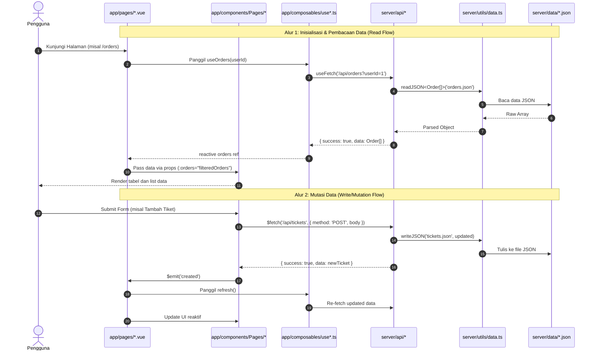

# ARCHITECTURE & CODING PATTERNS: NUXT 4 + TAILWIND 4

> **STATUS OVERRIDE 2026-10-09:** Dokumen ini adalah blueprint dan riwayat implementasi, bukan sumber status aktif. Untuk jawaban "sudah/belum", gunakan bagian **Status Kanonik Singkat** pada [CODEBASE_COMPLIANCE_AUDIT_2026-10-09.md](CODEBASE_COMPLIANCE_AUDIT_2026-10-09.md). Klaim lama `verified`, `100%`, jumlah baris, atau jumlah route di bagian riwayat tidak boleh dipakai tanpa audit ulang source.

> **Panduan kerja AI:** Baca [AGENTS.md](../AGENTS.md) sebelum mengubah menu. Panduan tersebut menetapkan pola revisi SALES pada bagian 20.4 sebagai acuan, termasuk struktur komponen, standar tabel, kecocokan HTML dan flow, serta perlindungan file dan data. Struktur layer wajib dinamai **Backend-Ready Vertical Slice (BRVS)** dan dirinci di [BACKEND_READY_VERTICAL_SLICE.md](BACKEND_READY_VERTICAL_SLICE.md).

Dokumen ini adalah **cetak biru (blueprint) teknis resmi** arsitektur, pemisahan tanggung jawab (separation of concerns), dan konvensi pengkodean yang digunakan dalam repositori ini.

Dokumen ini dirancang khusus agar dapat dipahami dan dijalankan secara presisi oleh AI maupun developer manusia saat membangun atau memperluas project baru agar konsisten 100% dengan pola project ini.

> **Struktur aktif:** Proyek memakai **Nuxt 4 + Tailwind CSS 4** dengan frontend di `app/`. Branch [Rama](https://github.com/noosabaktee/dulank-nuxt/tree/Rama) commit `76f6e79` hanya menjadi referensi route composer dan responsibility-based UI decomposition; arsitektur data/backend aktif tetap BRVS lokal. Dokumentasi berada di `docs/`, referensi HTML beserta asetnya di `legacy/static-source/`, dan backend tetap di `server/`. Riwayat pemindahan file dicatat dalam `MIGRATION_MANIFEST.json`.

---

## 1. Ikhtisar & Struktur Direktori

Proyek ini menggunakan **Nuxt 4** (`nuxt: ^4.5.2`) dengan **Tailwind CSS 4** (`tailwindcss: ^4.3.3` dan `@tailwindcss/vite: ^4.3.3`) dan runtime server berbasis **Nitro**, sesuai dependency utama [package.json repo acuan](https://github.com/noosabaktee/dulank-nuxt/blob/HEAD/package.json). Pemetaan direktori setelah penataan struktur dijelaskan pada bagian 16.1.

### 1.1 Struktur Direktori Aktif

Frontend mengikuti direktori standar Nuxt 4. Backend, aset publik, dan konfigurasi proyek tetap berada di root.

```text
├── app/
│   ├── app.vue                    # Entry NuxtLayout dan NuxtPage
│   ├── assets/css/main.css        # Tailwind 4 dan token tema admin
│   ├── components/                # Seluruh komponen domain dan komponen bersama
│   ├── composables/               # State, data fetching, dan helper frontend
│   ├── layouts/                   # default, auth, pos, print
│   ├── locales/                   # JSON terjemahan yang sudah ada
│   ├── pages/                     # Seluruh 188 halaman Nuxt pada audit 2026-10-09
│   ├── plugins/                   # Plugin frontend
│   └── stores/                    # Pinia stores
├── docs/
│   ├── STRUCTURE.md               # Panduan ini
│   └── DOKUMENTASI_SKRIPSI_KACETAK.md
├── legacy/static-source/
│   ├── assets/                    # CSS, JS, gambar, font, plugin, dan JSON referensi
│   ├── components/                # Partial HTML header, sidebar, dan backup
│   ├── *.html                     # Seluruh 186 HTML referensi asli
│   └── tailwind.config.ts         # Konfigurasi lama, dipertahankan sebagai arsip
├── public/                        # Aset publik, URL browser tetap sama
├── scripts/
│   ├── validate-structure.mjs      # Validasi struktur dan inventaris migrasi
│   └── scratch/                   # Script bantuan yang sebelumnya di scratch/
├── server/
│   ├── api/                       # Seluruh endpoint tetap dipertahankan
│   ├── data/                      # Seluruh 32 JSON sumber tetap dipertahankan
│   ├── types/                     # Kontrak tipe data domain
│   └── utils/                     # Utility backend dan akses data
├── data/                          # Lokasi data runtime lama, tetap dipertahankan
├── MIGRATION_MANIFEST.json         # Pemetaan file sebelum/sesudah beserta hash
├── README.md
├── nuxt.config.ts
├── package.json
├── package-lock.json
└── tsconfig.json
```

Nuxt memakai direktori sumber default `app/`; tidak ada lagi override `srcDir: '.'`. Folder `server/`, `public/`, dan `data/` tidak dipindahkan. Direktori `data/` adalah kompatibilitas penyimpanan runtime yang sudah digunakan `server/utils/data.ts`; penataan struktur tidak menimpa data runtime dengan JSON seed.

---

## 2. Layer `pages/` (`app/pages/`)

Halaman (`app/pages/*.vue`) bertindak sebagai **Thin Composition Layer**. Halaman **BUKAN** tempat menaruh markup UI monolitik atau styling kompleks.

Aturan lengkap decomposition berada di `docs/UI_DECOMPOSITION_STANDARD.md` (**BRVS-UI**). Page tipis tidak boleh dicapai dengan memindahkan seluruh markup dan flow ke satu `*Workspace.vue`.

### 2.1 Tanggung Jawab Halaman
1. Mendaftarkan metadata halaman dan runtime script/style lewat `useLegacyPage()`.
2. Memanggil **domain composable** (`useOrders()`, `useUserAddresses()`). `$fetch()` dan `useFetch()` data domain dilarang langsung di page.
3. Mengelola state koordinasi ringan seperti selected ID, dialog open, atau active tab. Filter/query, editor state, kalkulasi, dan mutation flow berada di composable atau komponen domain.
4. Menyusun (compose) komponen UI spesifik halaman dari `app/components/Pages/<route>/` dan mengirim data ke komponen via **typed props**.
5. Mendengarkan event dari komponen anak (misalnya `@created="refresh"`) untuk memicu pembaruan data.

Target page maksimal 150 baris. Di atas 200 baris wajib decomposition audit atau justifikasi arsitektural; di atas 300 baris otomatis `structural review required`. Page tetap gagal meskipun pendek bila menyimpan data domain hardcoded, type domain lokal, business calculation, request langsung, markup tabel/form/modal panjang, atau feedback palsu dengan `alert()`/`confirm()`.

Target Workspace/Screen orchestrator maksimal 150 baris. Workspace di atas 200 baris wajib decomposition audit dan di atas 300 baris structural review. Leaf/domain component ditargetkan maksimal 250 baris; komponen di atas 300 baris harus dipecah atau memiliki justifikasi satu tanggung jawab yang terdokumentasi.

### 2.2 Pola Penamaan File & Folder
- File route menggunakan nama **kebab-case** yang mencerminkan URL target:
  - `app/pages/index.vue` → `/`
  - `app/pages/orders.vue` → `/orders`
  - `app/pages/kalkulator-percetakan.vue` → `/kalkulator-percetakan`
  - `app/pages/support-ticket-detail.vue` → `/support-ticket-detail`
- Setiap route memiliki container root dengan class `.dulank-page.dulank-page-<route-name>`:

```vue
<template>
  <div class="dulank-page dulank-page-orders">
    <main>
      ...
    </main>
  </div>
</template>
```

### 2.3 Pemanggilan Komponen dari Halaman
Konfigurasi admin mempertahankan `components.pathPrefix: false`, sehingga nama auto-import mengikuti nama file komponen:
- `app/components/Address/AddressTable.vue` → `<AddressTable />`
- `app/components/Category/CategoryTable.vue` → `<CategoryTable />`
- `app/components/Common/PageHeader.vue` → `<PageHeader />`

Gunakan import eksplisit jika nama komponen bertabrakan. Contoh blueprint dengan nama berawalan `Pages...` di bagian berikutnya perlu disesuaikan dengan nama komponen atau alias import yang benar-benar digunakan; pemindahan ke `app/` tidak mengubah nama komponen yang sudah dipakai halaman.

### 2.4 Contoh Pola Komposisi Halaman (Referensi Blueprint)
```vue
<script setup lang="ts">
// 1. Inisialisasi metadata dan asset halaman
useLegacyPage({
  title: "Addresses",
  styles: ["/css/style.css", "/css/pages/address-inline.css"],
  scripts: [
    "/js/component.js",
    "/js/profile.js",
    "/js/address-input.js",
    "/js/pages/address.js",
  ],
  sweetAlert: false,
});

// 2. Fetch data menggunakan composable
const { addresses } = useUserAddresses();
</script>

<template>
  <div class="dulank-page dulank-page-address">
    <main>
      <div class="container my-5">
        <div class="row">
          <!-- Shared domain component -->
          <div class="col-lg-3 mb-4"><ProfileSidebar /></div>

          <div class="col-lg-9">
            <!-- Named UI components dari app/components/Pages/Address/ -->
            <PagesAddressNoAddressesState v-if="!addresses.length" />
            <PagesAddressAddAddressModal />
            <PagesAddressList
              v-if="addresses.length"
              :addresses="addresses"
            />
          </div>
        </div>
      </div>
    </main>
  </div>
</template>
```

---

## 3. Layer `components/` (`app/components/`)

Komponen dibagi ke dalam kategori yang jelas berdasarkan cakupan tanggung jawab (UI scope).

Pemisahan komponen wajib mengikuti tanggung jawab nyata: Header/Actions, Stats, Filters, Table/Grid/List, Form/Editor, Detail/History/Modal, dan Feedback. Nama `Workspace` atau `Screen` hanya untuk orchestrator, bukan wadah tunggal seluruh halaman.

### 3.1 Kategori Komponen
1. **Route-Specific Components (`app/components/Pages/<route>/`)**:
   - Wajib ada 1 folder untuk setiap file yang ada di `app/pages/`.
   - Menggunakan **nama file bahasa Inggris** yang menjelaskan fungsi UI spesifiknya:
     - `OrdersHeader.vue`, `OrderStatusTabs.vue`, `OrderRows.vue`, `EmptyOrdersState.vue`.
     - `AddressList.vue`, `AddAddressModal.vue`, `NoAddressesState.vue`.
   - **DILARANG** menggunakan nama generik seperti `Content.vue`, `Page.vue`, atau `Body.vue`.
2. **Shared Domain Components (`app/components/<domain>/`)**:
   - Digunakan oleh lebih dari satu halaman dalam domain yang sama:
     - `product/`: `ProductCard.vue`, `PriceTable.vue`, `SpecSelector.vue`, `DesignCard.vue`.
     - `profile/`: `Sidebar.vue`, `Header.vue`.
     - `support/`: `CreateTicketModal.vue`, `TicketConversation.vue`, `TicketRow.vue`.
     - `cart/`: shared widget cart antar-halaman.
3. **Global Layout Components (`app/components/Layout/`)**:
   - Komponen kerangka aplikasi: `AppHeader.vue`, `AppFooter.vue`, `MainNavbar.vue`, `CalculatorNavbar.vue`, `CalculatorHeader.vue`.
4. **Common Primitive Components (`app/components/Common/`)**:
   - Komponen generik non-domain: `Breadcrumb.vue`, `EmptyState.vue`, `QuantityControl.vue`.

### 3.2 Props & Emits Handling
Komponen adalah presentational & kontraktual. Semua data masuk melalui `defineProps` berbasis TypeScript type, dan aksi dikirim ke atas lewat `defineEmits`.

#### Contoh Komponen Tabel / List (`app/components/Pages/Address/AddressList.vue`):
```vue
<script setup lang="ts">
import type { UserAddress } from "#server/types/user";

// Typed props wajib menggunakan interface dari #server/types
defineProps<{
  addresses: UserAddress[];
}>();
</script>

<template>
  <div class="profile-content bg-white p-4 rounded-3 shadow-sm">
    <h4 class="fw-bold mb-4">Addresses</h4>
    <div class="address-list row">
      <div v-for="address in addresses" :key="`${address.type}-${address.street}`" class="col-md-6 mb-4">
        <div class="address-item pb-4">
          <div class="fw-semibold small">{{ address.recipientName }}</div>
          <div class="text-standard mb-2">{{ address.phone }}</div>
          <div class="text-standard mb-3">
            {{ address.name }},<br />{{ address.street }}<br />
            {{ address.city }} - {{ address.district }}, {{ address.province }}, {{ address.country }} {{ address.postalCode }}
          </div>
          <span class="text-standard border border-2 p-1 my-text-primary">{{ address.type }}</span>
        </div>
      </div>
    </div>
    <div class="mt-4">
      <button class="btn btn-dark my-bg-primary" data-bs-target="#addAddressModal" data-bs-toggle="modal" type="button">
        Add a new address
      </button>
    </div>
  </div>
</template>
```

#### Contoh Form / Control dengan `v-model` (`app/components/Pages/Orders/OrdersHeader.vue`):
```vue
<script setup lang="ts">
defineProps<{
  search: string;
  sort: "newest" | "oldest" | "highest";
}>();

defineEmits<{
  "update:search": [value: string];
  "update:sort": [value: "newest" | "oldest" | "highest"];
}>();
</script>

<template>
  <div class="d-flex justify-content-between">
    <h5>Orders</h5>
    <div class="d-flex">
      <input
        :value="search"
        class="form-control"
        placeholder="Search Job Title"
        type="search"
        @input="$emit('update:search', ($event.target as HTMLInputElement).value)"
      />
      <select
        :value="sort"
        class="form-select ms-2"
        @change="$emit('update:sort', ($event.target as HTMLSelectElement).value as any)"
      >
        <option value="newest">Newest</option>
        <option value="oldest">Oldest</option>
        <option value="highest">Highest</option>
      </select>
    </div>
  </div>
</template>
```

### 3.3 Batasan Logic: Kapan di Komponen vs Composable?
- **Logic di Komponen**:
  - State interaksi UI internal (contoh: dropdown toggle, tabs aktif lokal, modal open/close).
  - Formatting visual sederhana untuk display (contoh: `formatRupiah`, format tanggal lokal).
  - Emisi aksi user (`submit`, `change`, `select`).
- **Logic di Composable**:
  - Pengambilan data asynchronous dari API (`useFetch`, `$fetch`).
  - Seluruh flow domain frontend, termasuk filter/query state, payload mapping, editor orchestration, mutation, busy/error/refresh, dan preview calculation.
  - State global/shared yang perlu persist atau sinkron lintas navigasi route.

Komponen tidak melakukan persistence. Perhitungan otoritatif yang menentukan nilai tersimpan tetap berada dan divalidasi ulang di server domain service/repository.

---

## 4. Layer `server/` (Backend Nitro)

Direktori `server/` adalah backend mandiri yang dieksekusi di runtime server Nuxt (Nitro Engine).

```text
server/
├── api/          # Nitro route handlers (file-based API endpoints)
├── data/         # Flat-file database JSON persistence
├── types/        # TypeScript interfaces untuk data & domain entities
└── utils/        # Server-side helper utilities
```

### 4.1 Server Data Utility (`server/utils/data.ts`)
Semua endpoint membaca dan menulis ke penyimpanan data menggunakan utility standar `server/utils/data.ts`:

```ts
import { readFileSync, writeFileSync } from "node:fs";
import { join, resolve } from "node:path";

const dataDir = resolve(process.cwd(), "server", "data");

export function readJSON<T>(filename: string): T {
  const raw = readFileSync(join(dataDir, filename), "utf-8");
  return JSON.parse(raw) as T;
}

export function writeJSON<T>(filename: string, data: T): void {
  writeFileSync(join(dataDir, filename), JSON.stringify(data, null, 2), "utf-8");
}

export function createResponse<T>(data: T, meta?: Record<string, unknown>) {
  return { success: true, data, ...(meta ? { meta } : {}) };
}
```

Setiap respon API dibungkus oleh `createResponse()` sehingga memiliki struktur seragam:
```json
{
  "success": true,
  "data": { ... }
}
```

### 4.2 Target Backend-Ready untuk Setiap Menu

Revisi menu tidak boleh berhenti pada pemindahan markup. Setiap menu yang dinyatakan selesai harus siap dipindahkan ke backend/database nyata tanpa bongkar besar:

- **Kontrak data jelas:** semua field yang muncul di HTML, modal, detail, cetak, dan flow simpan harus dipetakan ke tipe domain di `server/types/`. Jangan menyimpan hanya field yang terlihat di tabel bila modal/detail membutuhkan data lain.
- **API menjadi sumber kebenaran:** page dan komponen tidak boleh memakai array transaksi hardcoded untuk flow aktif. Data dibaca lewat composable (`useFetch`/`$fetch`) ke `server/api/`; feedback sukses hanya mengikuti response API.
- **Utility server memegang persistensi dan validasi:** route handler tipis, sedangkan normalisasi, penomoran, kalkulasi total, filter tanggal, validasi pembayaran/refund, dan baca/tulis data berada di `server/utils/` atau helper domain yang bisa diganti adapter database.
- **Response stabil:** gunakan bentuk `success`, `data`, `message`, dan `meta` bila perlu. Perubahan backend berikutnya tidak boleh memaksa komponen UI membaca bentuk response baru per halaman.
- **Data runtime aman:** `data/` adalah penyimpanan runtime pengguna, `server/data/` adalah sumber JSON awal. GET tidak membuat/mengubah data, array kosong tetap valid, JSON rusak harus error jelas, dan seed ulang tidak boleh menimpa data pengguna.
- **Frontend tipis:** `app/pages/<route>.vue` hanya menyusun state koordinasi dan komponen. Form/tabel/detail berada di `app/components/Pages/<menu>/`, alur fetch/simpan di `app/composables/`, dan helper UI bersama di `app/components/Common/` atau `app/utils/`.
- **Reusable untuk fungsi dan style berulang:** bila filter, search, date range, status, action button, modal, print, formatter, atau control toolbar dipakai lebih dari satu menu, buat standar bersama. Jangan membiarkan setiap menu punya tinggi field, radius, warna, focus state, atau helper parsing yang berbeda untuk fungsi yang sama.
- **Siap DB:** ketika JSON nanti diganti database, idealnya perubahan berada pada `server/utils/`/repository dan bukan pada page/component. Karena itu ID, relasi record, detail item, payment history, source transaction, status, dan nomor dokumen harus disimpan eksplisit.

Menu **Sales** dan **Payment** adalah acuan paling aman saat ini untuk pola backend-ready. Gunakan keduanya sebagai contoh saat mengerjakan menu berikutnya, tanpa mengklaim seluruh halaman lain sudah memiliki kualitas backend yang sama.

Standar visual terbaru untuk control kecil di toolbar tabel mengikuti revisi Sales dan catatan client 2026-10-08: gaya light modern, tinggi `h-9`, background putih, border abu halus, radius sedang, shadow kecil, teks `text-sm` (14px), focus ring primary, dan spacing rapat. Standar ini berlaku untuk search, filter select, date range picker trigger, dan page-size selector. Jika dipakai lintas menu, pindahkan ke helper/shared class agar tidak muncul variasi baru.

---

## 5. Layer `api/` (`server/api/`)

Endpoints dibuat menggunakan **File-Based Routing Nitro** di dalam `server/api/`. File ini secara otomatis diekspos di route `/api/*`.

### 5.1 Konvensi Penamaan Method HTTP
Nama file menyertakan HTTP verb sebelum ekstensi file:
- `GET /api/orders` → `server/api/orders.get.ts`
- `GET /api/orders/:id` → `server/api/orders/[id].get.ts`
- `POST /api/cart` → `server/api/cart.post.ts`
- `POST /api/cart/clear` → `server/api/cart.clear.post.ts`
- `PUT /api/cart/:itemId` → `server/api/cart/[itemId].put.ts`
- `DELETE /api/cart/:itemId` → `server/api/cart/[itemId].delete.ts`
- `GET /api/catalog/:kind` → `server/api/catalog/[kind].get.ts`
- `GET /api/users/:id/addresses` → `server/api/users/[id]/addresses.get.ts`

### 5.2 Pola Implementasi Endpoint Server
Menggunakan fungsi Nitro `defineEventHandler`, `getQuery`, `readBody`, `getRouterParam`, dan `createError`.

#### Contoh Endpoint Query dengan Parameter (`server/api/orders.get.ts`):
```ts
import type { Order } from "#server/types/order";

export default defineEventHandler((event) => {
  const query = getQuery(event);
  const userId = Number(query.userId) || 1;

  const orders = readJSON<Order[]>("orders.json").filter(
    (order) => order.userId === userId,
  );

  return createResponse(orders);
});
```

#### Contoh Endpoint Mutasi POST dengan Validasi (`server/api/tickets.post.ts`):
```ts
import type { SupportTicket } from "#server/types/ticket";

export default defineEventHandler(async (event) => {
  const body = await readBody<{
    userId?: number;
    subject?: string;
    message?: string;
    priority?: string;
    type?: string;
  }>(event);

  if (!body?.subject?.trim() || !body?.message?.trim()) {
    throw createError({
      statusCode: 400,
      statusMessage: "Subject and message are required",
    });
  }

  const tickets = readJSON<SupportTicket[]>("tickets.json");
  const id = `TK-${String(tickets.length + 1).padStart(3, "0")}`;

  const ticket: SupportTicket = {
    id,
    userId: body.userId || 1,
    subject: body.subject.trim(),
    type: body.type || "Info Inquiry",
    message: body.message.trim(),
    priority: body.priority || "medium",
    status: "open",
    date: new Date().toISOString().split("T")[0],
    replies: [],
  };

  tickets.push(ticket);
  writeJSON("tickets.json", tickets);

  return createResponse(ticket);
});
```

---

## 6. Layer `types/` (`server/types/`)

Project ini menetapkan direktori `server/types/` sebagai **Single Source of Truth** untuk seluruh tipe data domain.

### 6.1 Konvensi Type
1. **Lokasi File**: Dikelompokkan per domain entitas dalam nama file singular kebab-case:
   - `server/types/user.ts`
   - `server/types/order.ts`
   - `server/types/ticket.ts`
   - `server/types/cart.ts`
   - `server/types/product.ts`
   - `server/types/category.ts`
   - `server/types/faq.ts`
   - `server/types/quotation.ts`
2. **Penamaan Interface**: Menggunakan **PascalCase** eksplisit:
   - `User`, `UserAddress`
   - `Order`, `OrderItem`, `ShippingAddress`
   - `SupportTicket`, `TicketReply`
3. **Import Alias**: Di-import di seluruh file aplikasi (`pages/`, `components/`, `composables/`, `server/api/`) menggunakan alias resmi:
   ```ts
   import type { UserAddress } from "#server/types/user";
   import type { SupportTicket } from "#server/types/ticket";
   ```
4. **Respon API Generic Wrapper**:
   Bila halaman atau composable membutuhkan type wrapper response:
   ```ts
   interface ApiResponse<T> {
     success: boolean;
     data: T;
     meta?: Record<string, unknown>;
   }
   ```

---

## 7. Layer `composables/` (`app/composables/`)

Composable membungkus logic asynchronous, data fetching, dan computed states agar dapat digunakan ulang di pages atau components.

### 7.1 Pola Pembuatan Composable
- Format file: `app/composables/use<FeatureName>.ts`.
- Menggunakan `useFetch` dengan konfigurasi `key` unik untuk mendukung SSR hydration caching.
- Menyediakan computed value agar komponen pemanggil menerima reactive ref yang bersih.

#### Contoh Composable Domain (`app/composables/useUserAddresses.ts`):
```ts
import type { UserAddress } from "#server/types/user";

interface AddressResponse {
  success: boolean;
  data: UserAddress[];
}

export function useUserAddresses(userId = 1) {
  const { data, pending, error, refresh } = useFetch<AddressResponse>(
    `/api/users/${userId}/addresses`,
    {
      key: `user-${userId}-addresses`,
    },
  );

  const addresses = computed<UserAddress[]>(() => data.value?.data ?? []);

  return { addresses, pending, error, refresh };
}
```

#### Contoh Composable Generic Catalog (`app/composables/useCatalog.ts`):
```ts
export interface CatalogResponse<T> {
  success: boolean;
  data: T[];
}

export function useCatalog<T>(kind: string) {
  const { data, pending, error } = useFetch<CatalogResponse<T>>(
    `/api/catalog/${kind}`,
    {
      key: `catalog-${kind}`,
    },
  );
  const items = computed<T[]>(() => data.value?.data ?? []);
  return { items, pending, error };
}
```

#### Special Composable: `useLegacyPage.ts`
Digunakan di setiap halaman `app/pages/*.vue` untuk menyuntikkan judul `<title>`, link CSS eksternal/font, dan script warisan tanpa konflik global:
```ts
useLegacyPage({
  title: "Page Title",
  styles: ["/css/style.css", "/css/pages/page-inline.css"],
  scripts: ["/js/component.js", "/js/pages/page.js"],
  sweetAlert: false, // set true jika halaman butuh SweetAlert2
});
```

---

## 8. Layer `layouts/` (`app/layouts/`)

Layout utama berada di `app/layouts/default.vue` dan dihubungkan secara global melalui `app/app.vue`:

```vue
<!-- app/app.vue -->
<template>
  <NuxtLayout>
    <NuxtPage />
  </NuxtLayout>
</template>
```

### 8.1 Mekanisme Dynamic Navigation di `default.vue`
Layout membaca path aktif via `useRoute()` dan secara otomatis memilih varian navigasi:
1. **`main`**: Menggunakan `<LayoutMainNavbar />` untuk halaman toko dan informasi publik (misal `/`, `/cart`, `/orders`, `/address`, `/categories`).
2. **`calculator`**: Menggunakan `<LayoutCalculatorNavbar />` untuk alat kalkulator cetak dan inventori mesin (misal `/kalkulator-percetakan`, `/semua-kertas`, `/store`).
3. **`page` (tanpa navbar global)**: Untuk halaman khusus seperti login, register, checkout, dan verify email yang telah memiliki header sendiri di dalam halamannya.
4. **Footer Suppression**: Menyembunyikan `<LayoutAppFooter />` pada rute tertentu (seperti `/print-order`).

```vue
<!-- app/layouts/default.vue -->
<script setup lang="ts">
const route = useRoute();

const mainNavbarRoutes = new Set(["/", "/orders", "/address", "/cart", "/categories", ...]);
const calculatorNavbarRoutes = new Set(["/kalkulator-percetakan", "/semua-kertas", ...]);

const normalizedPath = computed(
  () => route.path.replace(/\.html$/, "").replace(/\/$/, "") || "/",
);

const navbarType = computed(() => {
  if (calculatorNavbarRoutes.has(normalizedPath.value)) return "calculator";
  if (mainNavbarRoutes.has(normalizedPath.value)) return "main";
  return "page";
});

const showFooter = computed(() => normalizedPath.value !== "/print-order");
</script>

<template>
  <div class="dulank-layout min-h-screen bg-white">
    <header v-if="navbarType !== 'page'" class="dulank-global-header">
      <LayoutCalculatorNavbar v-if="navbarType === 'calculator'" />
      <LayoutMainNavbar v-else />
    </header>
    <div class="dulank-layout-content">
      <slot />
    </div>
    <LayoutAppFooter v-if="showFooter" class="dulank-layout-footer" />
  </div>
</template>
```

---

## 9. Layer `plugins/` (`app/plugins/`)

Plugin diletakkan di `app/plugins/` dan otomatis di-load oleh Nuxt.

### 9.1 Compatibility Shim: `legacy-ui.client.ts`
Project ini sengaja **TIDAK MENGGUNAKAN LIBRARY BOOTSTRAP RESMI** (JS bundle bootstrap dilarang). Sebagai gantinya, file `app/plugins/legacy-ui.client.ts` mengeksekusi emulator Bootstrap zero-dependency:
- Menyediakan class kompatibilitas minimal `Collapse`, `Modal`, `Tab`, `Toast`, `Carousel`, `Tooltip` pada objek `window.bootstrap`.
- Memasang event listener global untuk data attributes: `data-bs-toggle`, `data-bs-dismiss`, `data-bs-slide`, `data-bs-target`.
- Memungkinkan modal dan collapse tetap bekerja mulus tanpa menambahkan dependensi pihak ketiga.

---

## 10. Layer `utils/` (`app/utils/` & `server/utils/`)

Pemisahan fungsi utility murni (pure stateless helpers):

### 10.1 Client Utils (`app/utils/`)
Berisi fungsi helper murni di browser/client yang **tidak membutuhkan Vue reactivity** (`ref`, `computed`) dan **tidak mengakses lifecycle**:
- `app/utils/currency.ts`:
  ```ts
  export function formatRupiah(value: number): string {
    return String(value).replace(/\B(?=(\d{3})+(?!\d))/g, ".");
  }
  ```
- Di-auto-import oleh Nuxt sehingga dapat langsung dipanggil di component dan page: `formatRupiah(total)`.

### 10.2 Server Utils (`server/utils/`)
Berisi helper backend yang hanya diakses di sisi server (Nitro):
- `server/utils/data.ts`: Membaca & menulis file JSON (`readJSON`, `writeJSON`, `createResponse`).
- Otomatis di-import ke seluruh file di `server/api/`.

### 10.3 Perbedaan Utils vs Composables
| Kriteria | `utils/` | `composables/` |
|---|---|---|
| **Sifat** | Stateless & Pure JavaScript | Stateful & Reaktif Vue |
| **Reactivity API** | Tidak boleh ada `ref()`, `computed()` | Menggunakan `ref()`, `computed()` |
| **Asynchronous API** | Tidak memanggil `useFetch()` | Memanggil `useFetch()` atau `$fetch()` |
| **Contoh** | `formatRupiah(10000)`, formatting string | `useOrders()`, `useUserAddresses()` |

---

## 11. Arsitektur Alur Data (Data Flow Architecture)

Alur komunikasi data diatur secara satu arah (unidirectional data flow) untuk pembacaan, dan event-driven untuk mutasi:



---

## 12. Contoh Implementasi Lengkap (Real World Project Trace)

Berikut adalah penelusuran hubungan antar file nyata pada fitur **Support Ticket**:

### 1. Definisi Kontrak Data (`server/types/ticket.ts`)
```ts
export interface TicketReply {
  from: string;
  message: string;
  date: string;
}

export interface SupportTicket {
  id: string;
  userId: number;
  subject: string;
  type?: string;
  message: string;
  priority: string;
  status: string;
  date: string;
  replies: TicketReply[];
}
```

### 2. Mock Database (`server/data/tickets.json`)
```json
[
  {
    "id": "TK-001",
    "userId": 1,
    "subject": "Hasil cetak luntur",
    "type": "Complaint",
    "message": "Mohon dicek kembali pesanan saya...",
    "priority": "high",
    "status": "open",
    "date": "2026-09-20",
    "replies": []
  }
]
```

### 3. Server Endpoints
- **GET Handler (`server/api/tickets.get.ts`)**:
  ```ts
  import type { SupportTicket } from "#server/types/ticket";

  export default defineEventHandler((event) => {
    const query = getQuery(event);
    const userId = Number(query.userId) || 1;
    const tickets = readJSON<SupportTicket[]>("tickets.json");
    return createResponse(tickets.filter((t) => t.userId === userId));
  });
  ```
- **POST Handler (`server/api/tickets.post.ts`)**:
  ```ts
  import type { SupportTicket } from "#server/types/ticket";

  export default defineEventHandler(async (event) => {
    const body = await readBody<Partial<SupportTicket>>(event);
    if (!body?.subject || !body?.message) {
      throw createError({ statusCode: 400, statusMessage: "Required fields missing" });
    }
    const tickets = readJSON<SupportTicket[]>("tickets.json");
    const newTicket: SupportTicket = {
      id: `TK-${String(tickets.length + 1).padStart(3, "0")}`,
      userId: body.userId || 1,
      subject: body.subject,
      message: body.message,
      priority: body.priority || "medium",
      status: "open",
      date: new Date().toISOString().split("T")[0],
      replies: [],
    };
    tickets.push(newTicket);
    writeJSON("tickets.json", tickets);
    return createResponse(newTicket);
  });
  ```

### 4. Thin Page Layer (`app/pages/support-ticket.vue`)
```vue
<script setup lang="ts">
import type { SupportTicket } from "#server/types/ticket";

useLegacyPage({
  title: "Support Ticket",
  styles: ["/css/style.css", "/css/pages/support-ticket-inline.css"],
  scripts: ["/js/component.js", "/js/profile.js"],
  sweetAlert: false,
});

// Fetching data dengan useFetch
const { data, refresh } = useFetch<{ success: boolean; data: SupportTicket[] }>(
  "/api/tickets?userId=1",
);
const tickets = computed(() => data.value?.data ?? []);
</script>

<template>
  <div class="dulank-page dulank-page-support-ticket">
    <main>
      <div class="container my-5">
        <div class="row">
          <div class="col-lg-3 mb-4"><ProfileSidebar /></div>
          <div class="col-lg-9">
            <PagesSupportTicketList :tickets="tickets" />
          </div>
        </div>
      </div>
    </main>

    <!-- Modal Form: mendengarkan event emisi @created untuk refresh data -->
    <PagesSupportTicketCreateTicketModal @created="refresh" />
  </div>
</template>
```

### 5. Komponen Presentational List (`app/components/Pages/SupportTicket/TicketList.vue`)
```vue
<script setup lang="ts">
import type { SupportTicket } from "#server/types/ticket";

defineProps<{
  tickets: SupportTicket[];
}>();
</script>

<template>
  <div class="profile-content bg-white p-4 rounded-3 shadow-sm">
    <div class="d-flex justify-content-between align-items-center mb-4">
      <h4 class="fw-bold m-0">Support Tickets</h4>
      <button class="btn my-btn-primary" data-bs-toggle="modal" data-bs-target="#addNewTicketModal">
        Submit New Ticket
      </button>
    </div>
    <div class="ticket-list">
      <div v-for="ticket in tickets" :key="ticket.id" class="ticket-item p-3 border rounded mb-3">
        <div class="d-flex justify-content-between">
          <span class="badge bg-secondary">{{ ticket.id }}</span>
          <span class="text-muted small">{{ ticket.date }}</span>
        </div>
        <h6 class="fw-bold mt-2">{{ ticket.subject }}</h6>
        <p class="text-standard mb-0">{{ ticket.message }}</p>
      </div>
    </div>
  </div>
</template>
```

### 6. Komponen Mutasi Modal (`app/components/support/CreateTicketModal.vue`)
```vue
<script setup lang="ts">
const emit = defineEmits<{ created: [] }>();

const subject = ref("");
const message = ref("");
const submitting = ref(false);

async function submit() {
  submitting.value = true;
  try {
    await $fetch("/api/tickets", {
      method: "POST",
      body: { userId: 1, subject: subject.value, message: message.value },
    });
    subject.value = "";
    message.value = "";
    emit("created"); // Memicu refresh di parent page
    const modal = document.getElementById("addNewTicketModal");
    if (modal) (window as any).bootstrap?.Modal.getOrCreateInstance(modal).hide();
  } finally {
    submitting.value = false;
  }
}
</script>
```

---

## 13. Rules for AI

Bagian ini adalah **instruksi imperatif yang WAJIB ditaati** oleh setiap model AI saat membuat atau memodifikasi kode dalam project:

1. **Patuhi Pemisahan Direktori Nuxt 4**:
   - Seluruh halaman, komponen, composable, layout, plugin, dan client util berada di dalam folder `app/`.
   - Seluruh endpoint API, data mock, dan interface tipe data berada di dalam folder root `server/`.
   - Jangan membuat folder acak di luar konvensi ini.
2. **Halaman Harus Menjadi Thin Composition Layer**:
   - Dilarang menaruh template HTML ratusan baris di dalam `app/pages/*.vue`.
   - Pecah setiap section halaman menjadi komponen di `app/components/Pages/<route>/`.
   - Halaman hanya bertugas menghubungkan composable data dengan komponen UI.
   - Dilarang memindahkan monolit page ke satu `*Workspace.vue`; audit page, orchestrator, dan seluruh child component.
3. **Konvensi 1 Folder Komponen per Route**:
   - Untuk route `app/pages/foo-bar.vue`, wajib membuat folder `app/components/Pages/foo-bar/`.
   - Komponen di dalam folder ini harus menggunakan bahasa Inggris deskriptif (misal: `HeroSection.vue`, `FilterBar.vue`, `DataTable.vue`).
   - Dilarang menamakan file komponen dengan nama generik seperti `Content.vue`, `Body.vue`, atau `Page.vue`.
4. **Sentralisasi Types di `#server/types`**:
   - Jangan mendefinisikan interface data entitas berulang-ulang di file `.vue`.
   - Buat interface di `server/types/<entity>.ts` dan import menggunakan `import type { ... } from "#server/types/<entity>"`.
5. **Pola Data Fetching**:
   - Gunakan `useFetch()` di dalam composable untuk pembacaan data awal (SSR friendly).
   - Selalu berikan opsi `key` unik pada `useFetch()`.
   - Gunakan `$fetch()` di dalam method/handler untuk mutasi (`POST`, `PUT`, `DELETE`).
   - Jangan pernah melakukan import file sistem (`fs`, `path`) atau query database langsung di dalam komponen client.
6. **Props & Emits Wajib Typed**:
   - Gunakan sintaks TypeScript murni: `defineProps<{ item: Product }>()` dan `defineEmits<{ 'update:modelValue': [val: string] }>()`.
7. **Perbedaan Utils vs Composables**:
   - Jika suatu fungsi adalah helper murni matematika/formatting tanpa state reaktif, letakkan di `app/utils/` atau `server/utils/`.
   - Jika membutuhkan lifecycle, `ref`, `computed`, atau `useFetch`, letakkan di `app/composables/`.
8. **Jangan Tambahkan Dependensi Bootstrap**:
   - Repositori ini bebas dependensi Bootstrap runtime.
   - Styling diselesaikan via Tailwind CSS 4 dan file CSS kompatibilitas (`bootstrap-compat.css`).
   - Interaksi modal/dropdown/tab diselesaikan via `legacy-ui.client.ts`.
9. **Gunakan `<NuxtLink>`**:
   - Dilarang keras menggunakan tag `<a href="page.html">`. Gunakan `<NuxtLink to="/page">` tanpa ekstensi `.html`.
10. **Jangan Jalankan Git yang Mengubah Repo Tanpa Instruksi**:
   - Jangan menjalankan `git add`, `git commit`, `git push`, `git pull`, `git merge`, `git rebase`, `git checkout`, `git switch`, `git reset`, `git restore`, `git clean`, perubahan remote, atau operasi Git lain yang mengubah state repositori kecuali pengguna meminta secara eksplisit.
   - Perintah Git read-only seperti `git status`, `git diff`, `git log`, dan `git show` boleh dipakai untuk membaca kondisi repo tanpa mengubah file, branch, remote, index, atau history.
11. **Catat Delivery State Setiap Perubahan**:
   - Perbarui changelog untuk setiap perubahan code, data, atau dokumentasi.
   - Catat branch, commit status, push status, remote verification, validasi, dan risiko.
   - Jangan menulis `PUSHED` tanpa keberhasilan push dan bukti remote ref ke hash commit yang dimaksud.

---

## 14. Aturan Langkah Membuat Fitur Baru

Jika diperintahkan: **"Buat fitur X"** (Contoh: "Buat fitur Voucher"), lakukan langkah-langkah berikut secara berurutan:

```text
Langkah 1: Tentukan Tipe Data Domain (server/types/)
  └── Buat server/types/voucher.ts
      └── Ekspor interface Voucher, VoucherRedemption, dll.

Langkah 2: Siapkan Data Persistence (server/data/)
  └── Buat server/data/vouchers.json
      └── Isi array awal data seed.

Langkah 3: Bangun Endpoint API Server (server/api/)
  ├── Buat server/api/vouchers.get.ts (handler pembacaan daftar voucher)
  └── Buat server/api/vouchers/redeem.post.ts (handler mutasi/klaim voucher)
      └── Gunakan readJSON, writeJSON, dan createResponse dari server/utils/data.ts.

Langkah 4: Buat Composable Reaktif (app/composables/)
  └── Buat app/composables/useVouchers.ts
      ├── Import type dari "#server/types/voucher"
      └── Bungkus useFetch('/api/vouchers', { key: 'vouchers' }) dan ekspos ref/computed.

Langkah 5: Siapkan Folder & Komponen UI (app/components/Pages/voucher/)
  ├── Buat folder app/components/Pages/voucher/
  ├── Buat app/components/Pages/voucher/VoucherList.vue (menerima props vouchers: Voucher[])
  ├── Buat app/components/Pages/voucher/VoucherCard.vue (kartu item)
  └── Buat app/components/Pages/voucher/RedeemModal.vue (form modal + emisi aksi)

Langkah 6: Bangun Halaman Route (app/pages/voucher.vue)
  ├── Daftarkan useLegacyPage({ title: 'Voucher', styles: [...], scripts: [...] })
  ├── Panggil composable useVouchers()
  ├── Susun komponen: <PagesVoucherList :vouchers="vouchers" />
  └── Sambungkan event emisi: <PagesVoucherRedeemModal @redeemed="refresh" />

Langkah 7: Konfigurasi Layout (app/layouts/default.vue)
  └── Jika rute membutuhkan navigasi tertentu (misal main navbar atau calculator navbar),
      tambahkan '/voucher' ke dalam Set rute di app/layouts/default.vue.
```

---

## 15. Anti-Patterns (Hal yang Dilarang)

Berikut adalah daftar praktik buruk yang **dilarang keras** dalam arsitektur ini:

| Anti-Pattern | Mengapa Dilarang? | Solusi Sesuai Standar |
|---|---|---|
| **Menaruh fetch langsung di page atau komponen** | Menyebabkan data tidak sinkron, duplikasi request, dan sulit di-debug. | Semua request domain melalui `app/composables/use<Menu>.ts`, lalu data diteruskan via typed props. |
| **Membuat komponen bernama `Content.vue` atau `Page.vue`** | Melanggar validasi arsitektur project dan mengaburkan tanggung jawab UI. | Berikan nama spesifik bahasa Inggris: `OrderRows.vue`, `ProfileDetailsForm.vue`. |
| **Menulis ulang interface di setiap file `.vue`** | Merusak konsistensi tipe dan menyulitkan refactoring skema data. | Sentralisasi semua tipe di `server/types/*.ts` dan import via `#server/types/...`. |
| **Membuat folder baru di root tanpa alasan** | Merusak struktur standar Nuxt 4 (`app/` dan `server/`). | Ikuti folder yang sudah ada (`app/components`, `app/pages`, `server/api`, dll). |
| **Menginstall paket Bootstrap JS/CSS** | Memperbesar bundle size dan merusak layer kompatibilitas internal. | Gunakan Tailwind CSS 4 dan shim `legacy-ui.client.ts`. |
| **Memanggil file system (`fs`) di komponen `app/`** | Kode di `app/` berjalan di client browser dan akan memicu runtime error fatal. | Operasi sistem dan I/O data hanya boleh dilakukan di `server/` (Nitro). |
| **Hardcode link statis `.html`** | Mematikan Single Page Application (SPA) routing Nuxt. | Gunakan `<NuxtLink to="/orders">` tanpa akhiran `.html`. |
| **Menaruh business calculation di template/page** | UI sulit dibaca, tidak dapat diuji terisolasi, dan dapat berbeda dari nilai server. | Preview di editor composable; kalkulasi otoritatif dan validasi ulang di server domain service/repository. |

---

## 16. Ketentuan Pages Nuxt: Samakan Tampilan dengan HTML Referensi Menggunakan Tailwind

### 16.1 Konfigurasi dan Struktur yang Aktif

**Frontend berada di `app/`.** Penataan awal direktorinya pernah mengikuti branch Rama, tetapi aturan implementasi aktif sekarang adalah BRVS dan BRVS-UI. Semua halaman tetap mengikuti HTML dengan nama yang sama di `legacy/static-source/`. HTML tersebut sebelumnya berada di root proyek; pemindahan ini mempertahankan seluruh file aslinya.

| Bagian | Lokasi / konfigurasi aktif |
|---|---|
| Nuxt dan Tailwind | Nuxt `^4.5.2`, Tailwind CSS dan plugin Vite `^4.3.3`. |
| Vue, router, dan state | Vue `^3.5.40`, Vue Router `^5.2.0`, Pinia `^4.0.3`, modul Pinia Nuxt `^1.0.2`. |
| Frontend | `app/app.vue`, `app/pages/`, `app/components/`, `app/composables/`, `app/layouts/`, `app/plugins/`, `app/stores/`, dan `app/locales/`. |
| Styling | `app/assets/css/main.css`, termasuk token `@theme`, pemindaian `@source`, dan variant dark mode admin. |
| Backend | `server/api/`, `server/data/`, `server/types/`, dan `server/utils/` tetap di root. |
| Alias frontend | `~/` dan `@/` mengikuti direktori `app/` Nuxt 4. |
| Alias server | `#server`, `~/server`, dan `@/server` mengarah ke root `server/` agar import backend yang sudah ada tetap bekerja. |
| Alias type | `~/types` dan `@/types` tetap mengarah ke `server/types/`. |
| Referensi statis | `legacy/static-source/*.html`, `legacy/static-source/assets/`, dan `legacy/static-source/components/`. |
| Dokumentasi | `docs/`; petunjuk ringkas ada di `README.md`. |
| Data runtime dan publik | `data/` dan `public/` dipertahankan pada lokasi semula. |
| URL | Route Nuxt, alias `.html`, dan URL aset publik tetap sama. |

#### 16.1.1 Aturan Pelestarian File

1. Pindahkan file sesuai tanggung jawabnya tanpa mengganti isi halaman, JSON, API, type, atau utils dengan placeholder. Pemetaan dari path awal dicatat pada `MIGRATION_MANIFEST.json`.
2. Pertahankan kode bisnis dan integrasi data. Penyesuaian struktur dilakukan melalui konfigurasi sumber Nuxt, alias import, dan path script/dokumentasi.
3. Gunakan `app/assets/css/main.css` sebagai sumber token Tailwind 4. CSS utama disalin dari lokasi awal sebelum aset referensi diarsipkan; warna, font, dan dark mode admin tetap sama.
4. Jangan menghapus, melakukan seed ulang, atau menimpa JSON yang sudah ada. `server/utils/data.ts` tetap membaca/menulis direktori `data/`; JSON `server/data/` juga tetap dipertahankan.
5. Partial HTML dan seluruh aset sumber mengikuti HTML referensi ke `legacy/static-source/`. Referensi lama dapat disajikan dari direktori tersebut sebagai document root sehingga path aset relatif tetap sesuai.
6. Jalankan `npm run validate:structure` untuk mengecek file dan pasangan halaman/HTML. Opsi `-- --check-hashes` membandingkan isi file dengan snapshot setelah penataan struktur; perbedaan setelah pengembangan berikutnya perlu ditinjau, bukan dikembalikan otomatis.
7. Periksa build, route/API, dan interaksi browser setelah pemindahan. Uji GET tidak boleh mengubah JSON; kegagalan implementasi lama dicatat secara eksplisit.
8. **Jangan hapus HTML asli, CSS, JavaScript, partial, gambar, atau JSON referensi di `legacy/static-source/`.** Semuanya tetap menjadi acuan layout, style, dan alur interaksi, termasuk setelah halaman Vue dipisahkan menjadi komponen. Penataan kode tidak boleh menghilangkan tombol, form, navigasi, ataupun data yang sudah berjalan.

Nuxt 4 memakai `app/` secara default. Konfigurasi admin tetap mempertahankan metadata aplikasi, modul Pinia, alias type/server, dan kompatibilitas URL `.html`; jangan mengganti seluruh konfigurasi dengan contoh minimal.

### 16.2 Pemetaan HTML ke Halaman Nuxt

1. Pasangkan `legacy/static-source/<nama>.html` dengan `app/pages/<nama>.vue`. Contoh: `legacy/static-source/all-blog.html` menjadi acuan `app/pages/all-blog.vue` pada route `/all-blog`. Nuxt 4 membaca halaman dari direktori `app/pages/`.
2. Nama “allblog” mengacu ke halaman yang sudah ada, yaitu `all-blog.vue`; jangan membuat duplikat `allblog.vue`.
3. `legacy/static-source/index.html` berpasangan dengan `app/pages/index.vue` pada route `/`.
4. Edit halaman yang sudah ada beserta komponen terkait. Jika nantinya ada HTML di `legacy/static-source/` baru tanpa pasangan Nuxt, tambahkan halaman sesuai nama dan pola yang sama.
5. Gunakan `<NuxtLink>` dengan route Nuxt untuk navigasi internal. Alias URL `.html` yang sudah dikonfigurasi dalam `nuxt.config.ts` tetap menjadi kompatibilitas URL lama.
6. Baca setiap HTML pasangannya sebelum mengubah halaman; jangan menggunakan satu template generik untuk seluruh halaman.

### 16.3 Unsur Tampilan yang Wajib Sama

Yang harus dicocokkan adalah hasil tampilan di browser, bukan sekadar kesamaan nama class atau judul halaman:

- **Kerangka halaman:** header, sidebar, area konten, footer bila ada, lebar konten, serta posisi dan urutan setiap section. Gunakan layout bersama agar header/sidebar tidak muncul dua kali.
- **Tipografi dan warna:** keluarga font, ukuran, ketebalan, tinggi baris, warna teks, background, border, dan warna status/tombol.
- **Ukuran dan jarak:** margin, padding, gap, tinggi input/tombol, radius sudut, bayangan, ukuran gambar, dan proporsi kolom.
- **Header dan toolbar:** judul, subjudul, ikon, tombol tambah, pencarian, filter, pengurutan, ekspor, cetak, refresh, dan collapse sesuai elemen yang tersedia pada HTML sumber.
- **Konten utama:** jenis tampilan tabel atau kartu, urutan kolom, badge, checkbox, thumbnail, label, pagination, serta posisi tombol aksi.
- **Form dan modal:** susunan field, label, input, pilihan, upload/preview gambar, toggle, ukuran dialog, backdrop, dan tombol footer mengikuti referensi.
- **Responsivitas:** perilaku pada desktop, tablet, dan ponsel; jumlah kolom, pembungkusan toolbar, scroll tabel, dan lebar modal mengikuti HTML sumber.

Gunakan teks dan aset referensi untuk perbandingan tampilan awal. Data aplikasi tetap berasal dari alur data yang sudah tersedia. Jangan mengganti isi dengan kartu, statistik, field, gambar, atau section tambahan yang tidak ada pada referensi hanya untuk mengisi halaman.

### 16.4 Implementasi Styling dengan Tailwind

1. Implementasikan layout, spacing, tipografi, warna, border, shadow, dan responsive state menggunakan utility Tailwind CSS 4. Gunakan token `@theme` di `app/assets/css/main.css`; `legacy/static-source/tailwind.config.ts` tetap disimpan sebagai referensi nilai sebelum upgrade.
2. Jika ukuran atau warna referensi belum tersedia sebagai token, gunakan arbitrary value Tailwind atau tambahkan token bersama bila dipakai berulang. Cocokkan hasil render; ukuran dengan angka yang sama pada Bootstrap dan Tailwind belum tentu menghasilkan ukuran yang sama.
3. Periksa breakpoint CSS referensi. Jangan menganggap `xxl` Bootstrap sama dengan `2xl` Tailwind. Contoh: grid `legacy/static-source/all-blog.html` memakai `col-md-6 col-xxl-4`; pertahankan dua kolom mulai breakpoint `md` sumber dan tiga kolom mulai breakpoint `xxl` sumber.
4. Class Bootstrap pada contoh lama seperti `row`, `col-*`, `d-flex`, `btn`, `card`, dan `form-control` harus diterjemahkan ke styling Tailwind pada halaman yang dimigrasikan. Menyalin class tersebut saja belum memenuhi ketentuan.
5. Jangan memuat Bootstrap CSS/JS, jQuery, atau seluruh stylesheet legacy ke halaman Nuxt sebagai jalan pintas untuk menyamakan tampilan. HTML dan CSS lama dipakai untuk membaca referensi visual.
6. Bila CSS khusus masih diperlukan, batasi pada komponen terkait; gunakan CSS scoped atau fasilitas Tailwind 4 seperlunya. Hindari override global yang mengubah halaman lain.
7. Pertahankan pemisahan halaman, komponen, composable, dan tipe data. Gunakan kembali komponen domain yang sudah ada dan sesuaikan styling-nya; halaman tetap bertugas menyusun UI dan menghubungkan data.
8. Modal, dropdown, tab, filter, sort, dan aksi lain dikendalikan melalui state serta event Vue. Pertahankan integrasi data dan perilaku yang sudah berjalan saat mengganti styling.
9. Gunakan metadata Nuxt dan komponen layout yang tersedia. Jangan memasukkan satu dokumen HTML lengkap, iframe HTML lama, atau markup statis melalui `v-html` sebagai pengganti implementasi halaman.

### 16.5 Acuan Khusus Halaman Blog dan Address

Path di tabel ini merupakan lokasi aktif setelah penataan struktur Nuxt 4.

| Halaman Nuxt | Acuan HTML di `legacy/static-source/` | Bagian yang wajib dicocokkan |
|---|---|---|
| `app/pages/all-blog.vue` | `legacy/static-source/all-blog.html` | Header “Blogs” / “Manage your blogs”, toolbar dan tombol Add Blog, pencarian, filter status, sort, grid kartu dengan gambar/badge/tanggal/penulis/judul/aksi, pagination, serta modal Add Blog dan Edit Blog. |
| `app/pages/blog-category.vue` | `legacy/static-source/blog-category.html` | Header Blog Categories, toolbar/filter, tabel kategori dengan checkbox, tanggal, status, aksi, serta modal tambah/edit kategori. |
| `app/pages/blog-tag.vue` | `legacy/static-source/blog-tag.html` | Header Blog Tags, toolbar/filter, tabel tag dengan checkbox, tanggal, status, aksi, dan form/modal yang tersedia pada HTML sumber. |
| `app/pages/blog-comment.vue` | `legacy/static-source/blog-comment.html` | Header Blog Comments, toolbar, tabel komentar dengan tanggal, ratings, blog, penulis, dan aksi sesuai sumber. |
| `app/pages/address.vue` | `legacy/static-source/address.html` | Header Address List, statistik, tab customer/supplier, pencarian/filter, tabel alamat, tombol aksi, serta modal yang tersedia pada HTML sumber. |

Pola pencocokan yang sama berlaku untuk seluruh halaman di bagian 17, bukan hanya kelompok blog dan address.

### 16.6 Urutan Pengerjaan dan Kriteria Selesai

1. Buka HTML referensi beserta CSS/aset yang memengaruhi tampilannya; catat section, ukuran, breakpoint, serta kondisi interaksi yang perlu dicocokkan.
2. Periksa halaman Nuxt, layout, komponen, dan composable yang sudah ada. Tentukan bagian yang perlu disesuaikan tanpa menggandakan kerangka aplikasi.
3. Terapkan styling Tailwind pada komponen terkait, susun halaman, lalu hubungkan kembali data dan event Vue.
4. Bandingkan HTML dan Nuxt pada ukuran viewport dan data tampilan yang sama. Periksa desktop, tablet, dan ponsel, termasuk modal terbuka, dropdown, tab aktif, serta tabel yang panjang bila tersedia.
5. Verifikasi navigasi internal dan interaksi yang relevan; pastikan tidak ada aset hilang, error console, atau error hidrasi akibat perubahan.
6. Jalankan build proyek untuk perubahan kode. Catat halaman yang sudah diverifikasi dan perbedaan yang masih tersisa; jangan menyatakan tampilan sudah sama hanya karena route berhasil dibuka.

**Selesai berarti tampilan mengikuti HTML di `legacy/static-source/`, styling menggunakan Tailwind, dan fungsi halaman tetap berjalan.** Keberadaan file Vue pada inventaris berikut hanya menunjukkan pasangan file, bukan bukti halaman sudah selesai dimigrasikan atau diverifikasi secara visual.

---

## 17. Inventaris Lengkap Pages Nuxt dan HTML Referensi

Terdapat **186 halaman Nuxt** di `app/pages/`, seluruhnya mempunyai pasangan HTML asli di `legacy/static-source/`. Nama route dan isi file dipertahankan selama penataan direktori.

| Halaman Nuxt | HTML referensi | Route Nuxt |
|---|---|---|
| `app/pages/account-statement.vue` | `legacy/static-source/account-statement.html` | `/account-statement` |
| `app/pages/add-employee.vue` | `legacy/static-source/add-employee.html` | `/add-employee` |
| `app/pages/add-payroll.vue` | `legacy/static-source/add-payroll.html` | `/add-payroll` |
| `app/pages/add-product-process.vue` | `legacy/static-source/add-product-process.html` | `/add-product-process` |
| `app/pages/add-purchase.vue` | `legacy/static-source/add-purchase.html` | `/add-purchase` |
| `app/pages/add-quotation.vue` | `legacy/static-source/add-quotation.html` | `/add-quotation` |
| `app/pages/add-request-quotation.vue` | `legacy/static-source/add-request-quotation.html` | `/add-request-quotation` |
| `app/pages/add-sales.vue` | `legacy/static-source/add-sales.html` | `/add-sales` |
| `app/pages/add-work-flow.vue` | `legacy/static-source/add-work-flow.html` | `/add-work-flow` |
| `app/pages/address.vue` | `legacy/static-source/address.html` | `/address` |
| `app/pages/all-blog.vue` | `legacy/static-source/all-blog.html` | `/all-blog` |
| `app/pages/analytics-dashboard.vue` | `legacy/static-source/analytics-dashboard.html` | `/analytics-dashboard` |
| `app/pages/annual-reports.vue` | `legacy/static-source/annual-reports.html` | `/annual-reports` |
| `app/pages/appearance.vue` | `legacy/static-source/appearance.html` | `/appearance` |
| `app/pages/balance-account.vue` | `legacy/static-source/balance-account.html` | `/balance-account` |
| `app/pages/balance-sheet.vue` | `legacy/static-source/balance-sheet.html` | `/balance-sheet` |
| `app/pages/ban-ip-address.vue` | `legacy/static-source/ban-ip-address.html` | `/ban-ip-address` |
| `app/pages/bank-account.vue` | `legacy/static-source/bank-account.html` | `/bank-account` |
| `app/pages/bank-settings-grid.vue` | `legacy/static-source/bank-settings-grid.html` | `/bank-settings-grid` |
| `app/pages/bank-settings-list.vue` | `legacy/static-source/bank-settings-list.html` | `/bank-settings-list` |
| `app/pages/banner.vue` | `legacy/static-source/banner.html` | `/banner` |
| `app/pages/best-seller.vue` | `legacy/static-source/best-seller.html` | `/best-seller` |
| `app/pages/billing.vue` | `legacy/static-source/billing.html` | `/billing` |
| `app/pages/blank.vue` | `legacy/static-source/blank.html` | `/blank` |
| `app/pages/blog-category.vue` | `legacy/static-source/blog-category.html` | `/blog-category` |
| `app/pages/blog-comment.vue` | `legacy/static-source/blog-comment.html` | `/blog-comment` |
| `app/pages/blog-tag.vue` | `legacy/static-source/blog-tag.html` | `/blog-tag` |
| `app/pages/calender.vue` | `legacy/static-source/calender.html` | `/calender` |
| `app/pages/cart.vue` | `legacy/static-source/cart.html` | `/cart` |
| `app/pages/cash-advance.vue` | `legacy/static-source/cash-advance.html` | `/cash-advance` |
| `app/pages/cash-flow.vue` | `legacy/static-source/cash-flow.html` | `/cash-flow` |
| `app/pages/category.vue` | `legacy/static-source/category.html` | `/category` |
| `app/pages/cetak-full-color.vue` | `legacy/static-source/cetak-full-color.html` | `/cetak-full-color` |
| `app/pages/cetak-full-colorbekup.vue` | `legacy/static-source/cetak-full-colorbekup.html` | `/cetak-full-colorbekup` |
| `app/pages/checkout.vue` | `legacy/static-source/checkout.html` | `/checkout` |
| `app/pages/company-setting.vue` | `legacy/static-source/company-setting.html` | `/company-setting` |
| `app/pages/contact-form.vue` | `legacy/static-source/contact-form.html` | `/contact-form` |
| `app/pages/coupon.vue` | `legacy/static-source/coupon.html` | `/coupon` |
| `app/pages/create-product.vue` | `legacy/static-source/create-product.html` | `/create-product` |
| `app/pages/currency-settings.vue` | `legacy/static-source/currency-settings.html` | `/currency-settings` |
| `app/pages/custom-field.vue` | `legacy/static-source/custom-field.html` | `/custom-field` |
| `app/pages/customer-due-report.vue` | `legacy/static-source/customer-due-report.html` | `/customer-due-report` |
| `app/pages/customer-report.vue` | `legacy/static-source/customer-report.html` | `/customer-report` |
| `app/pages/customer-type.vue` | `legacy/static-source/customer-type.html` | `/customer-type` |
| `app/pages/customers.vue` | `legacy/static-source/customers.html` | `/customers` |
| `app/pages/delete-account.vue` | `legacy/static-source/delete-account.html` | `/delete-account` |
| `app/pages/delivery-note-detail.vue` | `legacy/static-source/delivery-note-detail.html` | `/delivery-note-detail` |
| `app/pages/delivery-note.vue` | `legacy/static-source/delivery-note.html` | `/delivery-note` |
| `app/pages/department.vue` | `legacy/static-source/department.html` | `/department` |
| `app/pages/designation.vue` | `legacy/static-source/designation.html` | `/designation` |
| `app/pages/discount-plan.vue` | `legacy/static-source/discount-plan.html` | `/discount-plan` |
| `app/pages/discount.vue` | `legacy/static-source/discount.html` | `/discount` |
| `app/pages/district.vue` | `legacy/static-source/district.html` | `/district` |
| `app/pages/download-files.vue` | `legacy/static-source/download-files.html` | `/download-files` |
| `app/pages/edit-employee.vue` | `legacy/static-source/edit-employee.html` | `/edit-employee` |
| `app/pages/edit-job-order.vue` | `legacy/static-source/edit-job-order.html` | `/edit-job-order` |
| `app/pages/edit-payroll.vue` | `legacy/static-source/edit-payroll.html` | `/edit-payroll` |
| `app/pages/edit-quotation.vue` | `legacy/static-source/edit-quotation.html` | `/edit-quotation` |
| `app/pages/edit-request-quotation.vue` | `legacy/static-source/edit-request-quotation.html` | `/edit-request-quotation` |
| `app/pages/edit-work-flow.vue` | `legacy/static-source/edit-work-flow.html` | `/edit-work-flow` |
| `app/pages/email-setting.vue` | `legacy/static-source/email-setting.html` | `/email-setting` |
| `app/pages/employee-salary.vue` | `legacy/static-source/employee-salary.html` | `/employee-salary` |
| `app/pages/employees.vue` | `legacy/static-source/employees.html` | `/employees` |
| `app/pages/expense-category.vue` | `legacy/static-source/expense-category.html` | `/expense-category` |
| `app/pages/expense-report.vue` | `legacy/static-source/expense-report.html` | `/expense-report` |
| `app/pages/expenses.vue` | `legacy/static-source/expenses.html` | `/expenses` |
| `app/pages/faq.vue` | `legacy/static-source/faq.html` | `/faq` |
| `app/pages/flow-category.vue` | `legacy/static-source/flow-category.html` | `/flow-category` |
| `app/pages/flow-name.vue` | `legacy/static-source/flow-name.html` | `/flow-name` |
| `app/pages/flow-template.vue` | `legacy/static-source/flow-template.html` | `/flow-template` |
| `app/pages/footer.vue` | `legacy/static-source/footer.html` | `/footer` |
| `app/pages/forgot-password.vue` | `legacy/static-source/forgot-password.html` | `/forgot-password` |
| `app/pages/gdpr-settings.vue` | `legacy/static-source/gdpr-settings.html` | `/gdpr-settings` |
| `app/pages/harga-jasa-lainya.vue` | `legacy/static-source/harga-jasa-lainya.html` | `/harga-jasa-lainya` |
| `app/pages/incentive.vue` | `legacy/static-source/incentive.html` | `/incentive` |
| `app/pages/income-category.vue` | `legacy/static-source/income-category.html` | `/income-category` |
| `app/pages/income-report.vue` | `legacy/static-source/income-report.html` | `/income-report` |
| `app/pages/income.vue` | `legacy/static-source/income.html` | `/income` |
| `app/pages/index.vue` | `legacy/static-source/index.html` | `/` |
| `app/pages/input-tax.vue` | `legacy/static-source/input-tax.html` | `/input-tax` |
| `app/pages/invoice-details.vue` | `legacy/static-source/invoice-details.html` | `/invoice-details` |
| `app/pages/invoice-report.vue` | `legacy/static-source/invoice-report.html` | `/invoice-report` |
| `app/pages/invoice-setting.vue` | `legacy/static-source/invoice-setting.html` | `/invoice-setting` |
| `app/pages/invoice.vue` | `legacy/static-source/invoice.html` | `/invoice` |
| `app/pages/job-branch.vue` | `legacy/static-source/job-branch.html` | `/job-branch` |
| `app/pages/job-list.vue` | `legacy/static-source/job-list.html` | `/job-list` |
| `app/pages/job-order-detail.vue` | `legacy/static-source/job-order-detail.html` | `/job-order-detail` |
| `app/pages/job-order.vue` | `legacy/static-source/job-order.html` | `/job-order` |
| `app/pages/job-progress.vue` | `legacy/static-source/job-progress.html` | `/job-progress` |
| `app/pages/kalkulator-dashboard.vue` | `legacy/static-source/kalkulator-dashboard.html` | `/kalkulator-dashboard` |
| `app/pages/kertas-group-self.vue` | `legacy/static-source/kertas-group-self.html` | `/kertas-group-self` |
| `app/pages/kertas-group.vue` | `legacy/static-source/kertas-group.html` | `/kertas-group` |
| `app/pages/kertas-harga-self.vue` | `legacy/static-source/kertas-harga-self.html` | `/kertas-harga-self` |
| `app/pages/kertas-harga.vue` | `legacy/static-source/kertas-harga.html` | `/kertas-harga` |
| `app/pages/kertas-jenis-self.vue` | `legacy/static-source/kertas-jenis-self.html` | `/kertas-jenis-self` |
| `app/pages/kertas-jenis.vue` | `legacy/static-source/kertas-jenis.html` | `/kertas-jenis` |
| `app/pages/kertas-ukuran-self.vue` | `legacy/static-source/kertas-ukuran-self.html` | `/kertas-ukuran-self` |
| `app/pages/kertas-ukuran.vue` | `legacy/static-source/kertas-ukuran.html` | `/kertas-ukuran` |
| `app/pages/komponen-fiks.vue` | `legacy/static-source/komponen-fiks.html` | `/komponen-fiks` |
| `app/pages/komponen-minimum.vue` | `legacy/static-source/komponen-minimum.html` | `/komponen-minimum` |
| `app/pages/language.vue` | `legacy/static-source/language.html` | `/language` |
| `app/pages/localization.vue` | `legacy/static-source/localization.html` | `/localization` |
| `app/pages/mesin-cetak-self.vue` | `legacy/static-source/mesin-cetak-self.html` | `/mesin-cetak-self` |
| `app/pages/mesin-cetak.vue` | `legacy/static-source/mesin-cetak.html` | `/mesin-cetak` |
| `app/pages/mesin-laminasi-self.vue` | `legacy/static-source/mesin-laminasi-self.html` | `/mesin-laminasi-self` |
| `app/pages/mesin-laminasi.vue` | `legacy/static-source/mesin-laminasi.html` | `/mesin-laminasi` |
| `app/pages/mesin-poli-self.vue` | `legacy/static-source/mesin-poli-self.html` | `/mesin-poli-self` |
| `app/pages/mesin-poli.vue` | `legacy/static-source/mesin-poli.html` | `/mesin-poli` |
| `app/pages/mesin-pond-self.vue` | `legacy/static-source/mesin-pond-self.html` | `/mesin-pond-self` |
| `app/pages/mesin-pond.vue` | `legacy/static-source/mesin-pond.html` | `/mesin-pond` |
| `app/pages/money-transfer.vue` | `legacy/static-source/money-transfer.html` | `/money-transfer` |
| `app/pages/my-incentive.vue` | `legacy/static-source/my-incentive.html` | `/my-incentive` |
| `app/pages/my-job.vue` | `legacy/static-source/my-job.html` | `/my-job` |
| `app/pages/online-orders.vue` | `legacy/static-source/online-orders.html` | `/online-orders` |
| `app/pages/orders.vue` | `legacy/static-source/orders.html` | `/orders` |
| `app/pages/otp.vue` | `legacy/static-source/otp.html` | `/otp` |
| `app/pages/our-client.vue` | `legacy/static-source/our-client.html` | `/our-client` |
| `app/pages/output-tax.vue` | `legacy/static-source/output-tax.html` | `/output-tax` |
| `app/pages/payment-gateway.vue` | `legacy/static-source/payment-gateway.html` | `/payment-gateway` |
| `app/pages/payment-inflow.vue` | `legacy/static-source/payment-inflow.html` | `/payment-inflow` |
| `app/pages/payment-outflow.vue` | `legacy/static-source/payment-outflow.html` | `/payment-outflow` |
| `app/pages/payments.vue` | `legacy/static-source/payments.html` | `/payments` |
| `app/pages/payslip-detail.vue` | `legacy/static-source/payslip-detail.html` | `/payslip-detail` |
| `app/pages/payslip.vue` | `legacy/static-source/payslip.html` | `/payslip` |
| `app/pages/permissions.vue` | `legacy/static-source/permissions.html` | `/permissions` |
| `app/pages/pos-order.vue` | `legacy/static-source/pos-order.html` | `/pos-order` |
| `app/pages/pos-settings.vue` | `legacy/static-source/pos-settings.html` | `/pos-settings` |
| `app/pages/pos.vue` | `legacy/static-source/pos.html` | `/pos` |
| `app/pages/preference.vue` | `legacy/static-source/preference.html` | `/preference` |
| `app/pages/prefixes.vue` | `legacy/static-source/prefixes.html` | `/prefixes` |
| `app/pages/printer-settings.vue` | `legacy/static-source/printer-settings.html` | `/printer-settings` |
| `app/pages/product-details.vue` | `legacy/static-source/product-details.html` | `/product-details` |
| `app/pages/product-list.vue` | `legacy/static-source/product-list.html` | `/product-list` |
| `app/pages/product-report.vue` | `legacy/static-source/product-report.html` | `/product-report` |
| `app/pages/profile.vue` | `legacy/static-source/profile.html` | `/profile` |
| `app/pages/profit-and-loss.vue` | `legacy/static-source/profit-and-loss.html` | `/profit-and-loss` |
| `app/pages/province.vue` | `legacy/static-source/province.html` | `/province` |
| `app/pages/purchase-category.vue` | `legacy/static-source/purchase-category.html` | `/purchase-category` |
| `app/pages/purchase-item.vue` | `legacy/static-source/purchase-item.html` | `/purchase-item` |
| `app/pages/purchase-order-detail.vue` | `legacy/static-source/purchase-order-detail.html` | `/purchase-order-detail` |
| `app/pages/purchase-order.vue` | `legacy/static-source/purchase-order.html` | `/purchase-order` |
| `app/pages/purchase-report.vue` | `legacy/static-source/purchase-report.html` | `/purchase-report` |
| `app/pages/purchase-return-detail.vue` | `legacy/static-source/purchase-return-detail.html` | `/purchase-return-detail` |
| `app/pages/purchase-return.vue` | `legacy/static-source/purchase-return.html` | `/purchase-return` |
| `app/pages/purchase.vue` | `legacy/static-source/purchase.html` | `/purchase` |
| `app/pages/quotation-detail.vue` | `legacy/static-source/quotation-detail.html` | `/quotation-detail` |
| `app/pages/quotation.vue` | `legacy/static-source/quotation.html` | `/quotation` |
| `app/pages/regency.vue` | `legacy/static-source/regency.html` | `/regency` |
| `app/pages/request-quotation-detail.vue` | `legacy/static-source/request-quotation-detail.html` | `/request-quotation-detail` |
| `app/pages/request-quotation.vue` | `legacy/static-source/request-quotation.html` | `/request-quotation` |
| `app/pages/reviews.vue` | `legacy/static-source/reviews.html` | `/reviews` |
| `app/pages/role-permissions.vue` | `legacy/static-source/role-permissions.html` | `/role-permissions` |
| `app/pages/role.vue` | `legacy/static-source/role.html` | `/role` |
| `app/pages/sales-dashboard.vue` | `legacy/static-source/sales-dashboard.html` | `/sales-dashboard` |
| `app/pages/sales-note.vue` | `legacy/static-source/sales-note.html` | `/sales-note` |
| `app/pages/sales-receipt.vue` | `legacy/static-source/sales-receipt.html` | `/sales-receipt` |
| `app/pages/sales-report.vue` | `legacy/static-source/sales-report.html` | `/sales-report` |
| `app/pages/sales-return.vue` | `legacy/static-source/sales-return.html` | `/sales-return` |
| `app/pages/sales.vue` | `legacy/static-source/sales.html` | `/sales` |
| `app/pages/security-settings.vue` | `legacy/static-source/security-settings.html` | `/security-settings` |
| `app/pages/semua-percetakan.vue` | `legacy/static-source/semua-percetakan.html` | `/semua-percetakan` |
| `app/pages/semua-toko-kertas.vue` | `legacy/static-source/semua-toko-kertas.html` | `/semua-toko-kertas` |
| `app/pages/signin.vue` | `legacy/static-source/signin.html` | `/signin` |
| `app/pages/sms-gateway.vue` | `legacy/static-source/sms-gateway.html` | `/sms-gateway` |
| `app/pages/social-authentication.vue` | `legacy/static-source/social-authentication.html` | `/social-authentication` |
| `app/pages/storage-settings.vue` | `legacy/static-source/storage-settings.html` | `/storage-settings` |
| `app/pages/store-list.vue` | `legacy/static-source/store-list.html` | `/store-list` |
| `app/pages/sub-category.vue` | `legacy/static-source/sub-category.html` | `/sub-category` |
| `app/pages/subscriptions.vue` | `legacy/static-source/subscriptions.html` | `/subscriptions` |
| `app/pages/supplier-due-report.vue` | `legacy/static-source/supplier-due-report.html` | `/supplier-due-report` |
| `app/pages/supplier-report.vue` | `legacy/static-source/supplier-report.html` | `/supplier-report` |
| `app/pages/supplier.vue` | `legacy/static-source/supplier.html` | `/supplier` |
| `app/pages/support-ticket-detail.vue` | `legacy/static-source/support-ticket-detail.html` | `/support-ticket-detail` |
| `app/pages/support-ticket.vue` | `legacy/static-source/support-ticket.html` | `/support-ticket` |
| `app/pages/system-setting.vue` | `legacy/static-source/system-setting.html` | `/system-setting` |
| `app/pages/tax-rates.vue` | `legacy/static-source/tax-rates.html` | `/tax-rates` |
| `app/pages/tax-report.vue` | `legacy/static-source/tax-report.html` | `/tax-report` |
| `app/pages/ticket-detail.vue` | `legacy/static-source/ticket-detail.html` | `/ticket-detail` |
| `app/pages/ticket-list.vue` | `legacy/static-source/ticket-list.html` | `/ticket-list` |
| `app/pages/unit.vue` | `legacy/static-source/unit.html` | `/unit` |
| `app/pages/user-admin.vue` | `legacy/static-source/user-admin.html` | `/user-admin` |
| `app/pages/user.vue` | `legacy/static-source/user.html` | `/user` |
| `app/pages/variant.vue` | `legacy/static-source/variant.html` | `/variant` |
| `app/pages/voucher.vue` | `legacy/static-source/voucher.html` | `/voucher` |
| `app/pages/wishlist.vue` | `legacy/static-source/wishlist.html` | `/wishlist` |
| `app/pages/work-flow.vue` | `legacy/static-source/work-flow.html` | `/work-flow` |

---

## 18. Riwayat Upgrade Framework Sebelum Penataan Folder

Tahap upgrade framework sebelum pemindahan ke `app/`, pada 26 September 2026, memasang Nuxt **4.5.2**, Tailwind CSS / plugin Vite **4.3.3**, Pinia **4.0.3**, dan modul Pinia Nuxt **1.0.2**. Versi terpasang lengkap tersimpan pada `package-lock.json`.

- Pada tahap upgrade versi, frontend masih di root dengan `srcDir: '.'`. Tahap penataan folder selanjutnya memindahkannya ke `app/` sesuai bagian 1 dan 16, dengan isi seluruh halaman tetap dipertahankan.
- Perbandingan terhadap **3.265 file awal yang tercatat Git** tidak menemukan file aplikasi yang hilang. Seluruh kode `server/api/`, **32 JSON di `server/data/`**, JSON aset, dan `server/utils/` tetap sama isinya. Direktori `data/` tetap dipertahankan; sebelum upgrade direktori ini memang belum berisi file.
- Empat komponen address, type address, dan composable `useLegacyPage` yang sebelumnya kosong dilengkapi agar halaman dapat dikompilasi dan metadata halaman bekerja. Type address mengikuti field API/JSON yang sudah ada. Data JSON tidak diinisialisasi ulang.
- `npm run build` berhasil. Uji HTTP memeriksa 186 halaman, dua alias `.html`, dan 32 endpoint GET: **219 dari 220 request sukses**.
- Endpoint `/api/blogs` masih menghasilkan HTTP 500 karena `server/api/blogs/index.get.ts` memang kosong sejak sebelum upgrade. File tersebut, endpoint blog lainnya yang masih kosong, serta JSON blog tetap dipertahankan; keberadaan route tidak berarti implementasi API blog sudah selesai.
- Pemeriksaan browser lulus untuk hidrasi dashboard, token warna Tailwind, toggle sidebar Pinia, tab alamat, pembukaan modal alamat, pencarian blog, dan menu mobile pada viewport 390px, tanpa exception browser yang tidak tertangani. Pemeriksaan ini tidak melakukan mutasi data melalui API.
- Header timing diagnostik Nitro dinonaktifkan agar metadata timing tidak menumpuk dan melampaui batas header setelah banyak request.

Validasi ini memeriksa upgrade framework dan pelestarian file. Pencocokan visual seluruh halaman terhadap HTML di `legacy/static-source/` tetap mengikuti pekerjaan dan kriteria pada bagian 16; belum dinyatakan selesai untuk seluruh 186 halaman.

---

## 19. Riwayat Penataan Awal Berdasarkan Branch Rama

Bagian ini adalah catatan migrasi historis. Ia tidak mengalahkan aturan BRVS/BRVS-UI yang berlaku sekarang.

Frontend dipindahkan ke `app/`, dokumentasi ke `docs/`, dan HTML/aset referensi ke `legacy/static-source/`. Backend tetap di `server/`, aset publik tetap di `public/`, dan lokasi data runtime tetap di `data/`.

- Inventaris sebelum pemindahan mencatat **3.266 file**, termasuk dokumen struktur. **2.226 file berpindah lokasi**; seluruh file awal ditemukan pada lokasi tujuannya tanpa kehilangan isi aplikasi atau data.
- Isi **186 halaman**, **94 file API**, seluruh **32 JSON server**, types, utils, komponen, composable, store, locale, dan aset tetap sama berdasarkan SHA-256. Perubahan isi hanya diperlukan pada konfigurasi Nuxt, script package, path parser sidebar, dan dokumen struktur.
- **186 HTML asli** dan **3 partial HTML** diarsipkan beserta asetnya. CSS utama aplikasi disalin ke `app/assets/css/main.css`; salinan sumbernya tetap ada di arsip legacy.
- `MIGRATION_MANIFEST.json` merekam path dan hash sebelum/sesudah. `npm run validate:structure -- --check-hashes` memeriksa keberadaan seluruh file beserta isi snapshot-nya.
- `npm run build` berhasil setelah pemindahan. Seluruh 186 route, dua alias `.html`, dan 31 API GET merespons sukses. Satu API GET blog tetap HTTP 500 karena implementasinya memang kosong sebelum pemindahan.
- Pemeriksaan browser untuk dashboard, sidebar Pinia, tab/modal alamat, pencarian blog, dan menu mobile lulus tanpa exception yang tidak tertangani.

File yang dibuka di editor sekarang adalah `app/pages/address.vue` dan `docs/STRUCTURE.md`. Status Git dapat menampilkan penghapusan path lama serta penambahan path baru sebelum file distage; inventaris dan hash menunjukkan file tersebut dipindahkan, bukan dibuang.

---

## 20. Implementasi Bertahap: Grup Menu SALES

Tahap ini mencakup tujuh route utama: `/sales`, `/invoice`, `/delivery-note`, `/sales-return`, `/quotation`, `/request-quotation`, dan `/pos`. Halaman sekarang menyusun komponen dan menghubungkan state/composable; markup tabel, editor, dan dialog berada di komponen terpisah. Form tambah/edit RFQ juga dihubungkan ke API daftar yang sama agar alur dari menu RFQ benar-benar menyimpan perubahan.

| Route | Komponen utama di `app/components/Pages/` | Composable |
|---|---|---|
| `/sales` | `sales/SalesRecordsTable.vue`, `sales/SalesEditor.vue` | `useSalesPage()` → `useSales()` |
| `/invoice` | `invoice/InvoiceRecordsTable.vue`, `invoice/InvoiceEditor.vue` | `useInvoicePage()` → `useInvoices()` |
| `/delivery-note` | `delivery-note/DeliveryNoteRecordsTable.vue`, `delivery-note/DeliveryNoteEditor.vue` | `useDeliveryNotePage()` → `useDeliveryNotes()` |
| `/sales-return` | `sales-return/SalesReturnRecordsTable.vue`, `SalesReturnEditor.vue`, `SalesReturnDetails.vue`, `SalesReturnPayment.vue` | `useSalesReturns()` |
| `/quotation` | `quotation/QuotationRecordsTable.vue`, `quotation/QuotationEditor.vue` | `useQuotationPage()` → `useQuotations()` |
| `/request-quotation` | `request-quotation/RequestQuotationRecordsTable.vue` | `useRequestQuotations()` |
| `/pos` | `pos/PosNavigation.vue`, `PosProductCatalog.vue`, `PosOrderSummary.vue`, `PosOrderAdjustments.vue`, `PosHeldOrders.vue`, `PosPaymentCheckout.vue`, `PosReceiptPreview.vue`, `PosCustomerPicker.vue`, `PosCartItemEditor.vue`, `PosRecentTransactions.vue` | `usePos()` |

### 20.1 Aturan Komposisi

- Root halaman memakai `dulank-page dulank-page-<route>`. Layout admin tetap menyediakan header/sidebar; POS memakai layout `pos`.
- `useLegacyPage({ title, sweetAlert: false })` mendaftarkan metadata. Implementasi admin saat ini tidak menyuntikkan CSS/JavaScript legacy; Tailwind dan event Vue menangani UI. `styles`/`scripts` pada contoh blueprint bukan kewajiban memuat Bootstrap.
- Komponen route di-import eksplisit bila memakai alias `Pages...`. Jangan mengandalkan awalan folder otomatis karena konfigurasi `pathPrefix: false` masih aktif.
- Type entitas tetap di `server/types/`, di-import melalui `#server/types/...`. Form dan tabel memakai props/emits TypeScript; `defineModel` dipakai untuk nilai form yang memang dua arah.
- `app/components/Sales/` menyediakan header, feedback, dialog, dan konfirmasi hapus bersama. Nama komponen domain lama tetap tersedia sebagai adapter menuju komponen route, sehingga pemanggil lama tetap kompatibel.
- `useSalesListActions()` menangani status editor, proses simpan/hapus, dan pesan kegagalan. Fungsi cetak di `app/utils/salesDocuments.ts` mencetak data pilihan melalui dialog browser, termasuk pilihan Save as PDF.

### 20.2 Penyimpanan dan Pelestarian Data

- File HTML/aset referensi dan seluruh JSON yang sudah ada tetap dipertahankan. Data contoh yang sebelumnya tertanam di halaman RFQ, Sales Return, dan katalog POS dipindahkan ke **file JSON baru**: `request-quotations.json`, `sales-returns.json`, dan `pos-products.json` di `server/data/`.
- Khusus endpoint grup ini, `readSalesData()` membaca direktori data runtime yang sama dengan util lama. JSON sumber dipakai sebagai nilai awal hanya jika file runtime belum tersedia. Array kosong tetap dihormati, dan JSON runtime yang rusak menghasilkan error agar tidak tertimpa data awal saat menyimpan. GET tidak membuat atau menimpa file data.
- Mutasi tetap disimpan ke `data/` melalui `writeJSON()`. `server/utils/data.ts` tidak diubah, dan tidak ada seed ulang terhadap data pengguna.
- Sales Return memiliki API daftar, simpan, hapus, dan pencatatan refund. Refund harus sesuai total dan tidak dapat dicatat dua kali. Pencatatan ini menyimpan status pembayaran; tidak mengirim uang melalui layanan pembayaran eksternal.
- RFQ memiliki API daftar, simpan, dan hapus. Duplikasi membuat identitas baru; form tambah/edit menyimpan metadata beserta baris barang.
- POS menyimpan item, spesifikasi, dan judul pekerjaan bersama transaksi penjualan. Dialog struk muncul setelah API berhasil; kegagalan mempertahankan keranjang. Pesanan hold mempertahankan customer dan biaya di penyimpanan browser agar dapat dilanjutkan setelah reload. Pilihan customer berlaku pada pesanan; pengelolaan master customer tetap melalui `/customers`.

### 20.3 Validasi

```bash
npm run build
npm run test:sales
npm run validate:structure
```

`test:sales` menjalankan hasil build Nitro dengan working directory sementara sehingga create/update/delete/refund tidak menyentuh `data/` proyek. Pengujian meliputi sumber data awal, mutasi empat domain lama, ID yang tidak ditemukan, item POS, duplikasi/dokumen RFQ, validasi refund, dan tujuh route beserta alias `.html`.

Hasil pemeriksaan tahap ini:

- Build, sepuluh pemeriksaan integrasi API, dan validasi keberadaan struktur lulus. Sebanyak 1.948 file arsip legacy dan JSON lama yang diperiksa tetap sama hash-nya; tidak ada file terlacak yang dihapus.
- Uji browser lulus untuk CRUD Sales, editor Invoice/Delivery Note/Quotation, detail/refund Sales Return, duplikasi/tambah/edit RFQ setelah reload, serta POS. Uji POS mencakup hold setelah reload, penolakan uang tunai kurang, kegagalan API yang mempertahankan checkout, dan penyimpanan item setelah pembayaran berhasil.
- Ketujuh halaman diperiksa pada viewport 390px tanpa overflow horizontal halaman; tabel lebar memiliki area scroll sendiri. Tidak ditemukan exception browser selama pengujian.
- Pengecekan TypeScript seluruh proyek masih melaporkan 196 error di luar file yang diubah pada tahap ini. Build yang berhasil tidak berarti typecheck seluruh modul sudah bersih.

`MIGRATION_MANIFEST.json` tetap menjadi snapshot penataan folder sebelumnya. Hash source yang sengaja diedit pada tahap Sales akan berbeda; jangan memperbarui seluruh hash atau mengembalikan perubahan fitur hanya untuk membuat snapshot lama cocok. Periksa bahwa semua file tetap ada dan arsip legacy serta JSON lama tetap utuh.

Halaman detail/cetak/tambah lain di luar tahap ini masih menggunakan implementasi masing-masing. Pencocokan visual dan kelengkapan seluruh flow dari semua HTML belum dinyatakan selesai untuk seluruh aplikasi.

### 20.4 Revisi Enam Halaman SALES terhadap HTML Referensi

Revisi ini mencakup Sales, Invoice, Delivery Note, Sales Return, Quotation, dan Request For Quotation. POS ditunda sesuai arahan pengguna. Referensi dibandingkan dengan HTML yang disimpan di `legacy/static-source/` dan halaman `https://dulank-admin.netlify.app/`.

- Keenam daftar menggunakan `SalesDataTable`, `SalesActionButton`, dan `SalesStatusBadge`. Ukuran font tabel mengikuti `text-sm` (14px) agar konsisten dengan font menu sidebar sesuai catatan client; warna teks, ukuran ikon Feather, pencarian, sorting, pagination, dan area scroll konsisten. Label serta urutan kolom mengikuti masing-masing HTML, termasuk **Sales Channel** dan **Quotation Channel**.
- Sales memiliki More pada kolom pertama, sebelum No Sales. Aksinya mencakup Sale Detail, Edit Sale, Show Payments, Sales Receipt, Sales Note, Create Invoice, Create Delivery Note, dan Delete Sale. Tombol Delete Sales History dan Cancel Transaction History membuka tabel riwayat dengan filter tanggal. Penghapusan melalui API juga mencatat riwayat.
- Add/Edit Sales memakai customer, pengiriman/pickup, PO, baris produk, voucher, biaya kirim, pajak, dan notes. Rincian tersebut disimpan bersama transaksi. Voucher diperiksa berdasarkan kode, periode aktif, dan batas pemakaian; tidak menampilkan keberhasilan palsu untuk kode yang tidak valid.
- Daftar Invoice mengikuti referensi dengan aksi lihat/hapus, tanpa tombol Edit atau Create Invoice pada header. Pembuatan invoice tetap tersedia dari menu More Sales dengan customer dan nilai transaksi terisi.
- Add/Edit Delivery Note memakai susunan dokumen: perusahaan, customer/Ship To, DN No, Dn Date, PO, Shipping BY, Reference, tabel barang/packing/berat, serta Receive By, Security / Check, Driver, dan Issued By. Editor mengisi data record yang dipilih dan menyimpan seluruh rinciannya.
- Modal Sales Return memakai pilihan customer dan No Sales, tabel Qty/Qty Return/Unit/Price/Amount/Description, Notes, dan Grand Total. Pemilihan penjualan mengisi item jika rinciannya tersedia; data lama yang belum menyimpan item tetap dapat dilengkapi. Detail dan Payment-OUT menampilkan data refund beserta rekening/referensi yang tersimpan.
- Add/Edit Quotation kembali berupa halaman dokumen terpisah, dengan metadata, customer, pengiriman, produk/MOQ/order, Term & Condition, biaya, pajak, dan tanda tangan. API menyimpan dokumen dan menghitung total dari item; data lama tanpa rincian tidak diisi dengan produk contoh yang tidak diketahui.
- Form RFQ mencakup metadata, tabel barang, Due Date, Payment Term, Quotation requested to, dan penandatangan. Duplicate Request for Quotation membuka modal **To:** sebelum menyimpan salinan dengan penerima dan nomor baru. Dokumen sumber tidak berubah.
- Sales Note dan Sales Receipt yang dibuka dari More menampilkan transaksi yang dipilih melalui parameter `id`. Rincian yang belum ada pada data lama tidak diganti dengan transaksi contoh.

Tambahan JSON sumber `sales-history.json` dan `sales-vouchers.json` menyalin data contoh yang memang sudah ada di HTML/halaman voucher. Seluruh JSON sumber lama, data runtime pengguna, dan HTML/aset referensi tetap dipertahankan. Pengujian mutasi menggunakan direktori sementara.

Validasi revisi: build, 13 pemeriksaan integrasi API, validasi struktur, dan uji browser lulus. Uji browser mencocokkan seluruh nama/urutan kolom serta computed font/warna keenam tabel, alur More dan history, add/edit dokumen, refund transfer, duplikasi RFQ ke penerima lain, serta pergantian alamat Shipping/Pickup. Keenam daftar dan modal Sales/Delivery Note/Sales Return diperiksa pada lebar 390px tanpa overflow halaman/modal. Tidak ada exception browser. Hash 1.953 file yang dilindungi tetap sama dan tidak ada file terlacak yang dihapus. Typecheck seluruh proyek masih memiliki 196 error di luar file yang diubah; file revisi tidak menghasilkan error TypeScript.

---

## 21. Implementasi Bertahap: Grup Menu PAYMENT

Tahap Payment mencakup `/payments`, `/payment-inflow`, dan `/payment-outflow`. Ketiga route ini memakai pola backend-ready yang menjadi acuan setelah Sales: page tipis, tabel/editor/detail dipisah ke komponen, data berasal dari API Nitro, kontrak data berada di `server/types/`, dan helper persistensi/validasi berada di `server/utils/`.

| Route | Komponen utama di `app/components/Pages/` | Composable | API |
|---|---|---|---|
| `/payments` | `payments/PaymentRecordsTable.vue` | `usePayments()` | `/api/payments` |
| `/payment-inflow` | `payment-flow/PaymentBalanceSummary.vue`, `PaymentFlowRecordsTable.vue`, `PaymentFlowEditor.vue`, `PaymentFlowDetails.vue` | `usePaymentFlow('inflow')` | `/api/payment-inflow` |
| `/payment-outflow` | `payment-flow/PaymentBalanceSummary.vue`, `PaymentFlowRecordsTable.vue`, `PaymentFlowEditor.vue`, `PaymentFlowDetails.vue` | `usePaymentFlow('outflow')` | `/api/payment-outflow` |

### 21.1 Kontrak Data dan Backend

- `server/types/payment.ts` mendefinisikan daftar gabungan Payments: Date Payment, Ref No, Name, Type, Payment Method, Amount (IDR), Status, dan Create.
- `server/types/payment-flow.ts` mendefinisikan Inflow/Outflow, termasuk balance summary, transfer bank, transaction detail, dan payment history.
- `server/data/payments.json`, `payment-inflows.json`, `payment-outflows.json`, dan `payment-balances.json` menjadi JSON sumber awal. Runtime data tetap tidak boleh ditimpa otomatis.
- `server/utils/paymentData.ts`, `paymentFlowData.ts`, dan `paymentFlow.ts` menjadi adapter data/validasi domain. Jika nanti masuk database, ubah lapisan ini lebih dulu, bukan page/component.
- Endpoint GET mendukung pencarian, filter source/type/method/status, serta `startDate` dan `endDate` untuk rentang waktu. Endpoint mutasi Payment Flow menyimpan Add/Edit/Payment/Delete melalui API, bukan state lokal sementara.

### 21.2 Standar Rentang Waktu

Fitur pemilih rentang waktu sudah distandarkan agar dapat dipakai ulang di menu lain:

- Frontend memakai `app/components/Common/DateRangePicker.vue`.
- State dan helper tanggal memakai `app/composables/useDateRange.ts`.
- Filtering server memakai `server/utils/dateRange.ts`.
- Preset mengikuti HTML legacy: Kemarin, 7 Hari Terakhir, Bulan Ini, Bulan Lalu, Tahun Lalu, dan Rentang Kustom.
- Query API memakai `startDate` dan `endDate`. Server harus bisa membaca tanggal legacy `DD/MM/YYYY` dan input ISO `YYYY-MM-DD`.

Jika halaman lain memiliki input `pemilihrentang`/Date Range dari HTML legacy, gunakan standar ini. Jangan membuat filter tanggal teks baru atau logika parsing tanggal berbeda per halaman.

### 21.3 Batas Regresi Payment

- `/payments` tidak boleh kembali ke data hardcoded di page. Tabel tetap memakai `PaymentRecordsTable.vue` dan `usePayments()`.
- `/payment-inflow` dan `/payment-outflow` harus mempertahankan balance summary, filter tanggal, filter source/status, detail record, editor add/edit/payment, payment history, dan delete confirmation.
- Tombol View, Payment, Edit, Delete harus selalu memakai record yang dipilih. Detail/cetak tidak boleh memakai contoh statis.
- Data lama yang belum memiliki rincian tertentu harus ditampilkan sebagai kosong/known value, bukan diisi transaksi, rekening, customer, atau pembayaran buatan.
- Label, urutan kolom, opsi source/status/method, dan flow modal tetap mengikuti `legacy/static-source/payment-inflow.html`, `payment-outflow.html`, `payments.html`, serta referensi Netlify yang diberikan pengguna.

### 21.4 Status Validasi dan Penyesuaian Modal Netlify

- Modal Payment pada `/payment-inflow` dan `/payment-outflow` disesuaikan dengan referensi Netlify (`custom-modal-two` style):
  - Lebar modal disesuaikan ke ukuran medium (`max-w-2xl` / ~672px).
  - Background header modal menggunakan `#fafbfe` dengan title `#092c4c`.
  - Tata letak form menggunakan susunan baris horizontal (label di kolom kiri `sm:w-1/3`, control input di kolom kanan `sm:w-2/3`).
  - Tombol aksi dialog mengikuti skema Netlify: Cancel berwarna gelap (`#212b36`) dan Submit berwarna aksen oranye/emas (`#ff9f43`).
- Sanity check rentang data dan pembacaan JSON Payment terverifikasi.
- Pada revisi Payment saat itu, `npm run build` dilaporkan berhasil tanpa error. Status tersebut bersifat historis dan bukan pengganti validasi ulang setelah perubahan berikutnya.

---

## 22. Implementasi Bertahap: Grup Menu WORKFLOW

Grup menu WORKFLOW mencakup empat menu operasional:
1. `/flow-category` (Kategori Alur Produksi)
2. `/flow-name` (Daftar Nama Alur & Insentif Kerja)
3. `/flow-template` (Template Parameter SPK)
4. `/work-flow`, `/add-work-flow`, dan `/edit-work-flow` (Konfigurasi Alur Kerja per Produk)

Keempat menu ini mengikuti standar backend-ready, reusable-first, halaman tipis, komponen domain terpisah, dan susunan visual sesuai file referensi `legacy/static-source/flow-category.html`, `flow-name.html`, `flow-template.html`, `work-flow.html`, `add-work-flow.html`, dan `edit-work-flow.html`.

| Route | Komponen utama di `app/components/Pages/` | Composable | API |
|---|---|---|---|
| `/flow-category` | `flow-category/FlowCategoryRecordsTable.vue`, `flow-category/FlowCategoryModal.vue` | `useFlowCategories()` | `/api/flow-categories` |
| `/flow-name` | `flow-name/FlowNameRecordsTable.vue`, `flow-name/FlowNameModal.vue` | `useFlowNames()` | `/api/flow-names` |
| `/flow-template` | `flow-template/FlowTemplateRecordsTable.vue`, `flow-template/FlowTemplateModal.vue` | `useFlowTemplates()` | `/api/flow-templates` |
| `/work-flow` | `work-flow/WorkFlowRecordsTable.vue`, `work-flow/WorkFlowProcessModal.vue` | `useWorkFlows()` | `/api/work-flows` |
| `/add-work-flow` | `work-flow/WorkFlowDocumentForm.vue` | `useWorkFlows()` | `/api/work-flows` (POST) |
| `/edit-work-flow` | `work-flow/WorkFlowDocumentForm.vue` | `useWorkFlows()` | `/api/work-flows/[id]` (GET, PUT) |

### 22.1 Kontrak Data dan Backend

- `server/types/flow-category.ts`: `id`, `no` (`PCC-xxx`), `name`, `used`, `createdBy`, `createdDate`.
- `server/types/flow-name.ts`: `id`, `no` (`JBP-xxxx`), `category`, `name`, `incentiveAmount`, `unitIncentive`, `flowAssignee`, `flowType`, `createDate`.
- `server/types/flow-template.ts`: `id`, `no` (`FT-xxxx`), `name`, `information`, `items?: FlowTemplateItem[]` di mana `FlowTemplateItem` terdiri dari `id`, `label`, `type` (`Input Type` | `Select Type`), dan `options?: string[]`.
- `server/types/work-flow.ts`: `id`, `no` (`JAP-xxxx`), `date`, `category`, `product`, `workflowSteps`, `steps: WorkFlowStepItem[]`.
- Seluruh JSON sumber awal tersimpan di `server/data/flow-categories.json`, `flow-names.json`, `flow-templates.json`, dan `work-flows.json`. Penyimpanan runtime disimpan terisolasi di `data/*.json` dan tidak ditimpa oleh seed.
- Validasi, penomoran otomatis prefix domain, dan filter tanggal ditangani di `server/utils/`.

### 22.2 Arsitektur UI & Komponen

- Tabel pada keempat menu menggunakan standar bersama `SalesDataTable.vue` (`text-sm`/14px), kontrol toolbar light modern `h-9`, `DateRangePicker.vue`, dan `SalesActionButton.vue`.
- Modal Add/Edit (`FlowCategoryModal`, `FlowNameModal`, `FlowTemplateModal`, `WorkFlowProcessModal`) menggunakan standar modal Netlify: lebar medium, header `#fafbfe`, judul `#092c4c`, tombol Cancel `#212b36`, dan Submit `#ff9f43`.
- **Flow Template Add/Edit Modal (`FlowTemplateModal.vue`) & Sub-modal (`FlowTemplateDataSelectModal.vue`):**
  - Mengimplementasikan alur lengkap HTML `flow-template.html`:
    - Field input `Flow Templete Name`.
    - Trigger `+ Add Information` yang membuka baris inline input (`Information` placeholder, tombol Cancel, dan tombol Save primary).
    - Tabel dinamis seluruh item informasi: menampilkan label (dengan kemampuan inline edit), tombol Edit, tombol Delete, dropdown tipe (`Input Type` / `Select Type`), dan tautan aksi Data Select (`Add Data Select` / `Edit Data Select`).
    - Sub-modal `Add Data Select` (`FlowTemplateDataSelectModal.vue`): menampilkan field `Information` (read-only), input penambahan opsi baru dengan tombol Add, dan kotak `Data Select Saved` yang memuat daftar pilihan tersimpan lengkap dengan tombol Hapus untuk masing-masing opsi, serta tombol Cancel dan Submit.
    - Sinkronisasi otomatis ke string `information` (comma-separated) dan array domain `items` yang tersimpan persisten ke backend API.
- Halaman konfigurasi dokumen `add-work-flow` dan `edit-work-flow` menggunakan form 2-kolom:
  - Kolom kiri: Live search produk, checklist stasiun kerja (Design, Cetak, PraCetak, Finishing), serta toggle template alur.
  - Kolom kanan: `Work Flow Arrange` sticky card dengan urutan stasiun produksi `No. 1`, `No. 2`, dsb. serta sepasang tombol reorder Up/Down (`arrow-up` & `arrow-down`) ukuran 34x34px.

### 22.3 Batas Regresi Workflow Group

- Tidak boleh ada halaman yang kembali menggunakan array mock lokal atau data statis di dalam file page.
- Seluruh mutasi (Add, Edit, Delete) harus tersimpan persisten ke API backend Nitro.
- Label kolom dan data pada tabel harus konsisten dengan file HTML legacy masing-masing.
- Seluruh tombol edit pada tabel harus membuka modal atau halaman edit dengan data record terpilih.
- Modal Add Flow Template dan Edit Flow Template WAJIB menyediakan seluruh fitur legacy secara presisi: tabel item informasi dinamis, penambahan baris inline, pergantian tipe input/select, dan sub-modal Add/Edit Data Select untuk konfigurasi opsi. DILARANG menurunkan form ini menjadi satu kolom textarea sederhana.

### 22.4 Status Validasi

- Sesuai arahan tegas pengguna, **`npm run dev` dan `npm run build` TIDAK dijalankan**.
- Validasi dilakukan secara statis:
  - Pemeriksaan integritas ukuran file seluruh modul di grup workflow (tidak ada file 0-byte atau placeholder).
  - Validitas syntax seluruh JSON data awal (`flow-categories.json`, `flow-names.json`, `flow-templates.json`, `work-flows.json`) terverifikasi.
  - Pemeriksaan statis kontrak tipe, API endpoints Nitro, utility server, dan composables untuk keempat submenu terhubung utuh tanpa broken paths.
  - Pemeriksaan kecocokan struktur tabel, toolbar, filter tanggal, modal, dan form dokumen dengan HTML legacy.

### 22.5 Standarisasi Dimensi & Komponen Reusable

- **Tinggi Kontrol Toolbar & Form:** Seluruh kontrol input, select filter toolbar tabel, search bar, dan input form modal harus menggunakan tinggi standar `h-9` (36px). Untuk kontrol tag / multi-select (seperti `AssigneeSelect.vue`), gunakan tinggi dasar `min-h-9` (36px) agar sejajar dengan kontrol lainnya.
- **Standar Filter Toolbar (`TableFilterSelect.vue`):** Dropdown filter standar toolbar tabel (`h-9`, `text-sm`/14px, border abu halus, background putih, shadow-sm, focus ring primary) menggantikan tag `<select>` manual lokal.
- **Standar Assignee Picker (`AssigneeSelect.vue`):** Pemilih penugasan standar modal (`min-h-9`, opsi radio Employees / Department, chips badge `#ff9f43`, search, dan floating dropdown selection).
- **Standar Grid 12 Kolom Modal:** Pada form modal, susun baris dengan CSS Grid 12 kolom murni:
  - Baris: `grid grid-cols-12 items-center gap-3 sm:gap-4` (`items-start` untuk field multiline/tags) atau helper `modalFormRowClass`.
  - Label: `col-span-5 text-xs font-semibold text-gray-700 dark:text-gray-300` atau helper `modalFormLabelClass`.
  - Input: `col-span-7` atau helper `modalFormInputColClass`.
  Pola ini menjamin posisi ujung kiri dan kanan seluruh input dalam modal 100% sejajar, presisi, dan tidak terdistorsi oleh kalkulasi flexbox.

---

## 23. Create Product & Standarisasi Komponen Reusable Baru

Bagian ini mendokumentasikan implementasi backend-ready halaman `/create-product` (`create-product.html` / `https://dulank-admin.netlify.app/create-product.html`) serta komponen reusable baru yang distandarisasi untuk digunakan di seluruh proyek (Sales, Product, POS).

### 23.1 Struktur Komponen & Pemisahan Tanggung Jawab

| File | Tanggung Jawab |
|---|---|
| `app/pages/create-product.vue` | Halaman form utama dengan 3 accordion card (Product Information, Pricing Type, Images), reactive state, integrasi API, feedback error, dan navigasi. |
| `app/components/Pages/CreateProduct/ProductInfoSection.vue` | Form informasi dasar produk: Store, Item Code (dengan tombol `Generate Code`), Product Name, Category (+ Add New modal trigger), Sub Category (+ Add New), Unit (+ Add New), Selling Type, Description. |
| `app/components/Pages/CreateProduct/ProductPricingSection.vue` | Tab navigasi 5 jenis harga (Single Product, Variable Product, Size Calculation, Large Format, Offset Service Price), form input spesifik per tipe, chip tag varian dinamis, serta tabel varian dengan QuantityStepper. |
| `app/components/Pages/CreateProduct/ProductCategoryModal.vue` | Modal dialog tambah kategori baru cepat menggunakan `SalesDialog` dan pola Grid 12 kolom. |
| `app/components/Pages/CreateProduct/ProductAttributeModal.vue` | Modal dialog tambah atribut varian baru (misal: Size, Color) beserta input tags nilainya. |
| `app/components/Pages/CreateProduct/ProductVariationModal.vue` | Modal dialog konfigurasi detail varian terpilih (Quantity, Price, Quantity Alert, Tax, Discount). |
| `app/components/Common/QuantityStepper.vue` | **Reusable Component**: Kontrol stepper kuantitas numerik standar (`[-] [ 2 ] [+]`) dengan tombol Feather icon, min/max/step bounding, mode compact tabel dan full form. |
| `app/components/Common/ImageUploadGrid.vue` | **Reusable Component**: Pengunggah gambar multi-file standar dengan area drag-and-drop, thumbnail preview, hover delete badge, dan validasi berkas. |

### 23.2 Kontrak Data & Backend Persistence

- `server/types/product.ts`:
  - `ProductPricingType`: `'Single Product' | 'Variable Product' | 'Size Calculation' | 'Large Format' | 'Offset Service Price'`.
  - `ProductVariant`: `{ id, variation, value, quantity, price, checked }`.
  - `ProductFormData`: Mendukung seluruh parameter harga (quantity, price, minOrderQty, discountType, discountValue, taxType, quantityAlert, minPrice, druckPrice, minLength, minWidth, images, variants).
- `server/api/products/index.post.ts`: Menerima form submission, memvalidasi kelengkapan data (nama produk, kategori), membangkitkan ID produk jika baru (`PRD-xxx`), dan menyimpan secara persisten ke `server/data/products.json`.
- Integrasi composable: `useProducts()`, `useCategories()`, dan `useUnits()`.

### 23.3 Standarisasi Komponen Reusable Baru

1. **`QuantityStepper.vue` (`app/components/Common/QuantityStepper.vue`):**
   - Props: `modelValue: number`, `min?: number` (default 0), `max?: number`, `step?: number` (default 1), `size?: 'sm' | 'md'` (default 'sm'), `disabled?: boolean`.
   - Menggunakan tombol minus (`minus`) dan plus (`plus`) Feather icon 12px/14px.
   - Input numerik diapit di tengah dengan alignment text-center, focus ring primary, dan proteksi batasan `min`/`max`.
   - Standar tinggi: `h-7` untuk compact table row, `h-9` untuk form reguler.

2. **`ImageUploadGrid.vue` (`app/components/Common/ImageUploadGrid.vue`):**
   - Props: `modelValue: string[]` (array gambar URL/base64), `maxImages?: number` (default 10), `disabled?: boolean`.
   - Area drag-and-drop / file selector dengan tombol Browse Files standar Netlify.
   - Grid thumbnail responsif (kolom dinamis 2 hingga 6 kolom), preview gambar terpotong rapi dengan aspect ratio persegi, serta tombol hapus (`x` icon) overlay merah saat di-hover.

---

## 24. Implementasi Menu Orders Group (Orders, Job Orders, Job List, Job Branch, My Job, My Incentive)

Bagian ini mendokumentasikan implementasi lengkap dan backend-ready untuk seluruh 6 submenu dalam grup **ORDERS** sesuai file HTML legacy di `legacy/static-source/` dan live Netlify `https://dulank-admin.netlify.app/`:
1. **Orders:** `orders.html` / `/orders`
2. **Job Orders:** `job-order.html` / `/job-order`
3. **Job List:** `job-list.html` / `/job-list`
4. **Job Branch:** `job-branch.html` / `/job-branch`
5. **My Job:** `my-job.html` / `/my-job`
6. **My Incentive:** `my-incentive.html` / `/my-incentive`

### 24.1 Struktur Komponen & Pemisahan Tanggung Jawab

| Menu | Page (`app/pages/`) | Komponen Domain (`app/components/Pages/<menu>/`) | Composable & Endpoint |
|---|---|---|---|
| **Orders** | `orders.vue` | `OrderStatsWidgets.vue`<br>`OrdersRecordsTable.vue`<br>`OrderStatusModal.vue` | `useOrders.ts`<br>`/api/orders/` (GET, POST, PUT, DELETE, stats) |
| **Job Orders** | `job-order.vue` | `JobOrderStatsWidgets.vue`<br>`JobOrderWorkflowSidebar.vue`<br>`JobOrderRecordsTable.vue`<br>`JobOrderEditModal.vue`<br>`JobOrderViewFlowModal.vue` | `useJobOrders.ts`<br>`/api/job-orders/` (GET, POST, DELETE) |
| **Job List** | `job-list.vue` | `JobListFlowSidebar.vue`<br>`JobListRecordsTable.vue`<br>`JobListDetailModal.vue` | `useJobList.ts`<br>`/api/job-list/` (GET, flows.get) |
| **Job Branch** | `job-branch.vue` | `JobBranchRecordsTable.vue`<br>`JobBranchSettingModal.vue` | `useJobBranches.ts`<br>`/api/job-branches/` (GET, PUT) |
| **My Job** | `my-job.vue` | `MyJobCardGrid.vue`<br>`MyJobDetailModal.vue`<br>`MyJobStatusModal.vue` | `useMyJobs.ts`<br>`/api/my-jobs/` (GET, POST, PUT, DELETE) |
| **My Incentive** | `my-incentive.vue` | `MyIncentiveStatsWidgets.vue`<br>`MyIncentiveRecordsTable.vue`<br>`MyIncentiveModal.vue` | `useMyIncentives.ts`<br>`/api/my-incentives/` (GET, POST, DELETE) |

### 24.2 Rincian Fitur & Keselarasan dengan Legacy HTML

1. **Orders (`/orders`):**
   - KPI Widgets: Total Orders, Pending Orders, In Process, Completed Orders.
   - Filter Toolbar: `DateRangePicker.vue` (kemarin, 7 hari, bulan ini, dsb), `TableFilterSelect.vue` untuk Shipping (All, Pickup, Courier, Delivery) dan Status (All, Pending, On Process, Completed, Cancelled).
   - Tabel: `SalesDataTable.vue` (`text-sm`/14px), kolom: Date, Order No, Customer, Shipping Type, Status, Sales Channel, Total (IDR), Action.
   - Modal: `OrderStatusModal.vue` (Grid 12 kolom untuk memperbarui status pesanan).

2. **Job Orders (`/job-order`):**
   - KPI Widgets: Total Job Order (154), Waiting (120), On Process (12), In-House (132), Outsource (2).
   - Layout 2 Kolom: Kolom kiri sidebar `JobOrderWorkflowSidebar.vue` (kategori workflow: Design, Pracetak, Cetak, Finishing dengan badge jumlah job), kolom kanan `JobOrderRecordsTable.vue`.
   - Modals:
     - `JobOrderEditModal.vue`: Modal edit Customer, Product, Job Title, Qty.
     - `JobOrderViewFlowModal.vue`: Modal alur kerja interaktif (Sales Information + Work Flow step timeline).

3. **Job List (`/job-list`):**
   - Layout 2 Kolom: Kolom kiri `JobListFlowSidebar.vue` ("All Flow" dengan akumulasi kuantitas per stasiun kerja alur produksi), kolom kanan `JobListRecordsTable.vue`.
   - Modals: `JobListDetailModal.vue` (`#view-units`) menampilkan Order Information lengkap (Sales Date, No Sales, Customer, Description) serta Job Completed Information (Kertas, Ukuran, Cetak, Mesin, Qty OK, Qty Rusak, Petugas Operator, Tanggal Selesai).

4. **Job Branch (`/job-branch`):**
   - Filter Toolbar: `DateRangePicker.vue`, `TableFilterSelect.vue` untuk Branch (All, Dulank Karawang, Dulank Jakarta, Dulank Cirebon) dan Priority (All, Urgent, High, Normal).
   - Tabel: `SalesDataTable.vue` (`text-sm`/14px), kolom: Order No, Date, Customer, Product, Job Title, Branch, Priority, Status, Action.
   - Modals: `JobBranchSettingModal.vue` (`#setting-job-branch`) dengan Grid 12 kolom untuk mengatur cabang pelaksana, prioritas kerja, dan status pengerjaan cabang.

5. **My Job (`/my-job`):**
   - Header Filter Prioritas: Tombol pill All, Urgent (merah), High (info), Normal (abu).
   - Card Grid Antrian: Responsive 4-kolom (`grid-cols-1 sm:grid-cols-2 lg:grid-cols-3 xl:grid-cols-4`), card dengan border dinamis sesuai prioritas, badge status, info spesifikasi produk, dropdown `Change Status` (`h-9`), serta tombol eye icon.
   - Modals:
     - `MyJobDetailModal.vue` (`#view-units`): Order Information dengan tombol PDF & Cetak, ringkasan produk, dan tabel rincian teknis lengkap (Kertas, Sisi Cetak, Ukuran, Model, Plat, Bahan, Insit, Contoh, dsb).
     - `MyJobStatusModal.vue` (`#modalUbahStatus`): Konfirmasi perubahan status dengan input `Qty Lembar OK ?` dan `Lembar Rusak ?` menggunakan Grid 12 kolom presisi.

6. **My Incentive (`/my-incentive`):**
   - KPI Widgets: Tampilan proporsional 2 widget ringkas (`Total Count Incentive` dengan icon `dash1.svg` dan `Amount Incentive` dengan icon `dash2.svg` dan format `Rp`).
   - Page Header: Title "My Incentive List", Subtitle "Manage My Incentive", action icons Pdf, Print, Refresh (tanpa tombol Add Incentive, sesuai HTML referensi Netlify).
   - Filter Toolbar: Pencarian, `DateRangePicker.vue` ("Date"), dan dropdown filter `Name Of Process` (`TableFilterSelect.vue`: Printing, Cutting).
   - Tabel: `SalesDataTable.vue` (`text-sm`/14px), tepat 7 kolom literal: Date, Job Title, Flow Name, Incentive, Unit, Qty, Amount (tanpa kolom Action karena menu ini merupakan portal log riwayat insentif karyawan).
   - Footer Tabel: Baris total kalkulasi akumulatif persis seperti `<tfoot>` HTML legacy (`Total` pada kolom 1, `colspan="5"`, dan total Amount pada kolom 7).

### 24.3 Standarisasi UI & Backend Persistence
- **Tinggi Kontrol & Grid:** Seluruh input, select, tombol, dan kontrol filter menggunakan tinggi standar `h-9` (36px). Form modal disusun dengan Grid 12 kolom (`col-span-5` label, `col-span-7` input).
- **Aturan Single Card Container (No Double Card Nesting):** `SalesDataTable.vue` sudah memiliki container card dengan styling background, border, dan shadow. Menempatkan `SalesDataTable` di dalam elemen wrapper card lain (`<div class="card p-4">...</div>`) menyebabkan card bersarang ganda yang tidak rapi. Gunakan `SalesDataTable` langsung di root page atau layout flex/grid tanpa pembungkus card tambahan.
- **Warna Tombol Standar Netlify:** Tombol cancel `#212b36` (dark) dan tombol submit/action `#ff9f43` (orange warning).
- **Backend Nitro & Data:** Data disimpan persisten pada `server/data/orders.json`, `job-orders.json`, `job-list.json`, `job-branches.json`, `my-jobs.json`, dan `my-incentives.json` dengan API RESTful lengkap (GET, POST, PUT, DELETE).
- **Cetak Work Order Ticket (SPK):** `app/utils/salesDocuments.ts` mengimplementasikan `printJobDetailTicket(job)` untuk menghasilkan lembar Surat Perintah Kerja (SPK) siap cetak dan simpan PDF yang dipicu oleh tombol cetak dan PDF di modal My Job.

### 24.4 Arsitektur Relasional Dummy Data (Migration Ready)
Seluruh data dummy grup Orders dirancang dengan Foreign Key dan Primary Key relasional yang sinkron untuk memudahkan migrasi ke PostgreSQL/MySQL:
- **Relasi Antar Entitas:**
  - `orders` (`id`, `no`, `customerId`, `branchId`, `items`: `productId`, `unitPrice`, `qty`, `total`, `totalAmount`)
  - `job-orders` (`id`, `no`, `orderId`, `customerId`, `branchId`, `productId`, `flowType`, `inputSpecs`, `outputSpecs`, `steps`)
  - `job-branches` (`id`, `no`, `jobOrderId`, `orderNo`, `customerId`, `branchId`, `infoList`, `afterInfoList`, `assignees`, `incentiveAmount`, `incentiveUnit`)
  - `job-list` (`id`, `no`, `jobOrderId`, `orderNo`, `customerId`, `branchId`, `productId`, `qtyOk`, `qtyRusak`, `assignee`, `dateComplete`)
  - `my-jobs` (`id`, `jobOrderId`, `orderId`, `customerId`, `branchId`, `productId`, `employeeId`, `qtyOk`, `qtyRusak`, input teknis cetak)
  - `my-incentives` (`id`, `code`, `jobOrderId`, `employeeId`, `branchId`, `process`, `incentive`, `unit`, `qty`, `amount`, `status`)
- **Penyempurnaan Modal Job Branch (`JobBranchSettingModal.vue` & `JobBranchHistoryModal.vue`):**
  - Editor dinamis spesifikasi sebelum cetak (`infoList`) dengan tombol `+ Add Information` dan hapus per baris.
  - Editor dinamis spesifikasi sesudah cetak (`afterInfoList`) dengan tombol `+ Add Information After`.
  - Integrasi pemilih operator penanggung jawab menggunakan `AssigneeSelect.vue`.
  - Pengaturan besaran insentif per job (`incentiveAmount`) dan satuan pengerjaan (`incentiveUnit`: Job, Lembar, Rim, Meter, Pcs).
  - Modal riwayat pengerjaan cabang (`JobBranchHistoryModal.vue`) terhubung ke endpoint `/api/job-branches/history`.

### 24.5 Standarisasi Format Uang & Separator Ribuan (Currency System)
Untuk mengatasi inkonsistensi formatting mata uang (Rupiah / IDR) di seluruh form dan tabel, telah disediakan utilitas dan komponen bersama:
1. **Utility `currency.ts` (`app/utils/currency.ts` & re-export di `salesUi.ts`):**
   - `formatMoney(value, options?)`: Memformat angka murni menjadi string berpemisah ribuan Indonesia (`.` titik) dengan opsi prefix (cth: `1000000` ➔ `1.000.000` atau `Rp 1.000.000`).
   - `formatIDR(value, withSpace?, fallback?)`: Shortcut formatting Rupiah standar (cth: `formatIDR(25000)` ➔ `Rp 25.000`).
   - `parseMoney(value)`: Mengubah string berpemisah ribuan kembali menjadi `number` murni (cth: `"Rp 1.500.000"` ➔ `1500000`).
   - `currencyAlignClass(align)`: Mengembalikan kelas Tailwind untuk perataan teks (`text-right justify-end font-mono tabular-nums` atau `text-left justify-start font-mono tabular-nums`).
2. **Komponen `CurrencyInput.vue` (`app/components/Common/CurrencyInput.vue`):**
   - Input uang real-time yang memformat pemisah ribuan secara otomatis saat pengguna mengetik dengan menjaga posisi kursor.
   - Mendukung justifikasi kanan (`align="right"`) maupun kiri (`align="left"`).
   - Memiliki prefix badge `"Rp"` yang rapi dan memancarkan nilai asli bertipe `number` ke `v-model` untuk kemudahan persistensi ke database.
3. **Komponen `CurrencyDisplay.vue` (`app/components/Common/CurrencyDisplay.vue`):**
   - Komponen representasi nilai uang untuk cell tabel, kartu ringkasan, dan dokumen cetak.
   - Mendukung prop `align="right"` (rata kanan) dan `align="left"` (rata kiri), font monospaced tabular nums, dan prefix custom.

## 25. Standardisasi & Implementasi Modul WEBSTORE

Grup modul **WEBSTORE** menghubungkan langsung sistem admin Dulank dengan storefront publik e-commerce percetakan (`https://percetakan-dulank.netlify.app/`). Seluruh halaman telah distandarisasi mengikuti template referensi Netlify (`https://dulank-admin.netlify.app/`), dengan arsitektur backend-ready, komponen terpisah, dan penyimpanan numerik murni.

### 25.1 Pemetaan Halaman WEBSTORE
1. **Cart (`/cart`):**
   - KPI Widgets: `Total Cart Amount` (`dash1.svg`, format `CurrencyDisplay`), `Total Cart Active` (`dash2.svg`), `Total Cart Checkout` (`dash3.svg`), `Total Cart Delete` (`dash4.svg`).
   - Toolbar: Search input, `DateRangePicker.vue`, `TableFilterSelect.vue` (Category: Brochure, Flyer, Banner, Stationery; Status: Active, Checkout, Delete).
   - Tabel: `SalesDataTable.vue` (`text-sm`/14px), kolom: Product (gambar thumbnail + nama produk), User (email), Category, Price (rata kanan), Qty, Total Price (rata kanan), Date, Status (badge).
   - Tanpa kolom aksi sesuai referensi HTML Netlify.

2. **Checkout (`/checkout`):**
   - KPI Widgets: `Total Checkout` (`dash1.svg`), `Total Revenue` (`dash2.svg`, format `CurrencyDisplay`), `Total Success` (`dash3.svg`), `Total Failed` (`dash4.svg`).
   - Toolbar: Search input, `DateRangePicker.vue`, `TableFilterSelect.vue` (Metode: Kartu Kredit, Transfer Bank, E-Wallet, Virtual Account; Status: Berhasil, Gagal).
   - Tabel: `SalesDataTable.vue` (`text-sm`/14px), kolom: User, Date Checkout, Payment (rata kanan), Metode, Status, Voucher, Delivery fee (rata kanan), Detail Product.
   - Tanpa kolom aksi sesuai referensi HTML Netlify.

3. **Wishlist (`/wishlist`):**
   - KPI Widgets: `Total Wishlist Amount` (`dash1.svg`, format `CurrencyDisplay`), `Total Wishlist Active` (`dash2.svg`), `Total Wishlist Checkout` (`dash3.svg`), `Total Wishlist Delete` (`dash4.svg`).
   - Toolbar: Search input, `DateRangePicker.vue`, `TableFilterSelect.vue` (Category & Status).
   - Tabel: `SalesDataTable.vue` (`text-sm`/14px), kolom: Product, User, Category, Price, Qty, Total Price, Date, Status.

4. **Reviews (`/reviews`):**
   - KPI Widgets: Tepat 3 widget proporsional (`Total Review` `dash1.svg`, `Total Product` `dash2.svg`, `Total Publish` `dash3.svg`).
   - Toolbar: Search input, `DateRangePicker.vue`, `TableFilterSelect.vue` (Rating 1-5).
   - Tabel: `SalesDataTable.vue` (`text-sm`/14px), kolom: User, ID Produk, Product, Date, Rating (1-5) dengan ikon bintang, Title, Review, Status (Publish / Unpublish).

5. **Support Ticket (`/support-ticket`):**
   - KPI Widgets: `Total Tickets` (`dash1.svg`), `Total Pending Tickets` (`dash2.svg`), `Total Closed Tickets` (`dash3.svg`), `Total Delete Tickets` (`dash4.svg`).
   - Page Header: Title "Support Ticket List", Subtitle "Manage your Support Ticket", tombol "Add Ticket", icon PDF, Print, Refresh.
   - Toolbar: Search input, `DateRangePicker.vue`, `TableFilterSelect.vue` (Priority: Low, High, Medium; Status: Open, Closed, Pending).
   - Tabel: `SalesDataTable.vue` (`text-sm`/14px), kolom: ID, Requested By (avatar + nama), Subject, Assignee, Priority, Status, Created Date, Due Date, Action (View detail, Delete).
   - Modals:
     - `SupportTicketAddModal.vue`: Form pembuatan tiket bantuan (Avatar, Customer Name, Email, Phone, Address, City, Country, Descriptions).
     - `SupportTicketDetailModal.vue`: Modal detail komprehensif dari `support-ticket-detail.html` (informasi tiket, requested by, assigned agent, deskripsi, tags, timeline activity, dan live interactive chat history).
     - `SalesConfirmDelete.vue`: Dialog konfirmasi penghapusan tiket.

6. **Contact Form (`/contact-form`):**
   - KPI Widget: 1 widget ringkas `Total Contact` (`dash1.svg`).
   - Toolbar: Search input, `DateRangePicker.vue`.
   - Tabel: `SalesDataTable.vue` (`text-sm`/14px), tepat 5 kolom literal sesuai referensi HTML Netlify: Name, Email, Phone, Message, Date (tanpa kolom Action).

### 25.2 Arsitektur Data & Standar Mutlak
- **Penyimpanan Numerik Murni:** Nilai `price`, `totalPrice`, `payment`, `deliveryFee` di seluruh mock data JSON disimpan sebagai `number` murni tanpa format string statis.
- **Relasi Database Ready:** Entitas dilengkapi dengan Primary Key (`id`), serta Foreign Key relasional (`customerId`, `productId`, `orderId`).
- **Single Card Container:** Seluruh tabel menggunakan `SalesDataTable.vue` langsung tanpa pembungkus card ganda.
- **Kontrol Standar:** Tinggi input dan select `h-9` (36px), rentang tanggal menggunakan `DateRangePicker.vue`, dan filtering dropdown menggunakan `TableFilterSelect.vue`.

---

## 26. Standardisasi Fitur Cetak (Print & PDF Export) Seluruh Halaman

### 26.1 Latar Belakang & Masalah Sebelumnya
Sebelum standardisasi:
1. Banyak halaman langsung memanggil `window.print()`, yang menyebabkan layout website (navbar header, sidebar menu `ms-[260px]`, background gelap dark mode, dan tombol-tombol aksi) ikut ter-capture dan merusak hasil cetak di kertas.
2. Tidak adanya Kop Surat resmi perusahaan percetakan, nomor halaman, dan kolom tanda tangan (TTD) formal yang dibutuhkan untuk laporan bisnis.
3. Tidak adanya dialog pemilihan cakupan data (seluruh data, halaman aktif, atau rentang waktu).

### 26.2 Solusi Arsitektur Standar

1. **Mesin Cetak Terisolasi Iframe (`app/utils/documentPrinter.ts`):**
   - Menggunakan elemen `<iframe>` tersembunyi yang menerima dokumen HTML mandiri, sehingga 100% terisolasi dari DOM aplikasi Nuxt, komponen interaktif, dan CSS tema.
   - **Kop Surat Resmi Dulank:** Menampilkan logo resmi, identitas "PT. DULANK SEMESTA CIDA", tagline layanan percetakan, alamat lengkap Karawang Barat, kontak telepon/WA, email, dan garis ganda pembatas resmi kop surat.
   - **Tabel Data Rapi:** Header berlatar abu-abu halus, padding baris proporsional, border solid bersih, kolom numerik/uang otomatis rata kanan (`text-right font-mono`), kolom ID/status rata tengah, dan kolom 'action' / aksi otomatis diabaikan.
   - **Bagian Tanda Tangan (TTD):** Tempat dan tanggal otomatis ("Karawang, [Tanggal]") dan 2 kolom tanda tangan: "Dibuat Oleh" (Staff Administrasi) dan "Mengetahui" (Manager Operasional).

2. **Modal Dialog Interaktif Cetak (`app/components/Common/DocumentPrintModal.vue`):**
   - Terbuka otomatis saat tombol **Print** atau **PDF** pada toolbar header tabel (`SalesListHeader.vue`) ditekan.
   - Pilihan Cakupan Data:
     - **Semua Data Terfilter (`all`)**: mencetak seluruh baris data aktif.
     - **Halaman Ini Saja (`current`)**: mencetak baris data di halaman pagination yang sedang dilihat.
     - **Rentang Tanggal Khusus (`date-range`)**: menyaring tanggal secara dinamis menggunakan `DateRangePicker.vue`.
   - Opsi Dokumen: Checkbox toggle Kop Surat Resmi, Kolom TTD, Waktu & Tanggal Cetak.
   - Orientasi Kertas: Pilihan Landscape (mendatar) atau Portrait (tegak).
   - Tombol Aksi: "Simpan sebagai PDF" dan "Cetak Dokumen".

3. **Composable Bersama (`app/composables/useTablePrint.ts`):**
   - Memudahkan integrasi fitur cetak ke halaman mana pun cukup dengan mengimpor composable dan menyematkan `<DocumentPrintModal>`.

4. **Proteksi Layout Global (@media print):**
   - Layout default (`app/layouts/default.vue`) dilengkapi atribut `print:hidden` pada `AppHeader` dan `AppSidebar`, serta `print:p-0 print:m-0 print:ms-0 print:w-full` pada container `<main>`.
   - CSS global (`app/assets/css/main.css`) menetapkan background putih murni dan menyembunyikan elemen navigasi sehingga halaman dokumen khusus seperti **Sales Note** (`sales-note.vue`) dan **Sales Receipt** (`sales-receipt.vue`) tidak tergeser margin atau bocor elemen navbar.

5. **Pengecualian Cetak Dokumen Khusus (Template Khusus dari HTML Asli):**
   - Halaman dengan format dokumen fisik spesifik tetap menggunakan template aslinya:
     - **Sales Receipt (`/sales-receipt`):** Struk kasir thermal 80mm format roll paper.
     - **Sales Note (`/sales-note`):** Nota penjualan formal dengan rincian barang.
     - **SPK My Job / Job Order (`printJobDetailTicket`):** Lembar Surat Perintah Kerja teknis pengerjaan cetak.
     - **Invoice Details, Delivery Note Detail, Quotation Detail, Request Quotation Detail, Payslip Detail.**

---

## 27. Standardisasi Reusable Skeleton Loader Seluruh Halaman

### 27.1 Latar Belakang & Kebutuhan
Sebelumnya, feedback saat memuat data (*pending state*) hanya berupa teks biasa atau spinner kecil yang menimbulkan pergeseran tata letak (*layout shift*) saat data tiba. Untuk meningkatkan pengalaman pengguna (UX) ke standar modern SaaS:
1. Diperlukan komponen skeleton loader yang meniru persis dimensi dan susunan komponen aslinya.
2. Harus reusable agar dapat digunakan di seluruh 186 halaman admin Nuxt.

### 27.2 Komponen Skeleton Reusable yang Disediakan
1. **`AppSkeleton.vue` (`app/components/Common/AppSkeleton.vue`):**
   - Komponen primitif dengan animasi `animate-pulse`, warna adaptif Tailwind (`bg-gray-200/80 dark:bg-gray-700/60`), bentuk fleksibel (`rounded-sm`, `md`, `lg`, `xl`, `full` / circle), serta lebar dan tinggi yang dapat dikonfigurasi.
2. **`TableSkeleton.vue` (`app/components/Common/TableSkeleton.vue`):**
   - Komponen skeleton tabel komprehensif yang meniru container kartu `SalesDataTable`:
     - Toolbar baris atas: input pencarian `h-9` dan tombol dropdown filter `h-9`.
     - Header tabel abu-abu halus.
     - Baris data dinamis (`rows` & `cols`) dengan simulasi avatar, teks dengan variasi lebar realistis, dan tombol aksi baris.
     - Pagination bar bawah lengkap dengan tombol navigasi halaman.
3. **`CardSkeleton.vue` (`app/components/Common/CardSkeleton.vue`):**
   - Komponen skeleton kartu statistik/metrik KPI untuk dashboard dan laporan.
4. **Integrasi ke `SalesFeedback.vue` (`app/components/Sales/SalesFeedback.vue`):**
   - Dilengkapi prop `skeleton="table" | "card" | "none"` dan `:skeleton-cols="10"` sehingga setiap halaman cukup menyertakan `<SalesFeedback :pending="pending" skeleton="table" />`.

---

## 28. Implementasi Menu Peoples: Customers (`/customers`)

### 28.1 Ringkasan Implementasi
Modul **Customers** di bawah grup menu **PEOPLES** telah direfaktor penuh dari template Bootstrap lama ke arsitektur Nuxt 4 + Tailwind CSS + Backend-ready sesuai acuan `legacy/static-source/customers.html` (`https://dulank-admin.netlify.app/customers.html`):

1. **Halaman Tipis (`app/pages/customers.vue`):**
   - Menggunakan `useLegacyPage({ title: 'Customers', sweetAlert: false })`.
   - Mengintegrasikan toolbar header `SalesListHeader.vue` dengan aksi Refresh, Print, PDF, dan tombol "Add New Customer".
   - Menggunakan feedback loading modern `<SalesFeedback :pending="pending" skeleton="table" :skeleton-cols="10" />`.
2. **Tabel Data Pelanggan (`app/components/Pages/Customers/CustomerRecordsTable.vue`):**
   - Menggunakan `SalesDataTable.vue` (`text-sm font-medium`, 14px).
   - 10 kolom literal: Customer ID, Name, Email, Customer Type, Balance (rata kanan numerik via `<CurrencyDisplay>`), Contact No, Join Channel, Date Join, Last Seen, Action.
   - Filter toolbar: Pencarian realtime, `DateRangePicker.vue`, dan dropdown filter `TableFilterSelect.vue` Customer Type.
   - Aksi baris: Tombol `+ Address`, View detail, Edit, dan Delete.
3. **Form Modal Tambah / Edit (`app/components/Pages/Customers/CustomerFormModal.vue`):**
   - Menggunakan `SalesDialog.vue` ukuran medium.
   - Tata letak 12-kolom CSS Grid (`modalFormRowClass`, `modalFormLabelClass`, `modalFormInputColClass`).
   - Kontrol tinggi standar `h-9`.
4. **Modal Detail & Alamat Pelanggan (`app/components/Pages/Customers/CustomerViewModal.vue`):**
   - 2 Tab interaktif: "Customer Details" dan "Address" (menampilkan daftar alamat pengiriman yang terhubung).
5. **Modal Tambah Alamat Baru (`app/components/Pages/Customers/CustomerAddAddressModal.vue`):**
   - Form penambahan alamat langsung terhubung ke relasi data `customerId` dan endpoint `/api/address`.
6. **Dialog Hapus & Cetak Resmi:**
   - Konfirmasi hapus `SalesConfirmDelete.vue`.
   - Cetak tabel dan ekspor PDF resmi via `DocumentPrintModal.vue` (Kop Surat resmi PT Dulank Semesta Cida dan kolom TTD).

---

## 29. Standarisasi Bundled JSON Registry untuk Deployment Netlify Serverless

### 29.1 Latar Belakang & Masalah Lingkungan Serverless Netlify
Saat aplikasi dideploy ke Netlify (`https://dulankadminnuxt.netlify.app/`), backend Nitro berjalan di lingkungan *serverless function* (AWS Lambda). Di lingkungan ini:
1. Pembacaan berkas fisik melalui filesystem runtime (`readFileSync(join(process.cwd(), 'data', ...))`) gagal menemukan file karena isolasi kontainer serverless.
2. Akibatnya, `readJSON` sebelumnya mengembalikan array kosong `[]`, menyebabkan tabel-tabel di seluruh halaman Netlify tidak menampilkan data (kosong).
3. Modul Sales sebelumnya berhasil menampilkan data karena mengimpor berkas JSON secara statis di `salesData.ts`, sehingga datanya ikut terkompilasi (*in-memory bundle*) ke dalam Nitro chunk.

### 29.2 Solusi Terpusat: `bundledData.ts` & `data.ts`
Untuk menyelesaikan masalah ini secara menyeluruh di seluruh aplikasi tanpa mengubah puluhan endpoint API satu per satu:
1. **Registry Terpusat (`server/utils/bundledData.ts`):**
   - Mengimpor seluruh berkas JSON aktif di `server/data/` secara statis ke dalam objek map `bundledSources: Record<string, unknown>`. Setiap dataset baru wajib langsung ditambahkan ke registry; jangan bergantung pada angka jumlah berkas yang cepat kedaluwarsa.
   - Semua dataset secara otomatis ikut ter-bundle ke dalam build produksi Nitro (`.output/server/`).
2. **Fallback Cerdas di `readJSON()` (`server/utils/data.ts`):**
   - **Tingkat 1:** Jika berkas fisik runtime di `data/` atau `server/data/` ditemukan (lingkungan lokal / dev / file yang dimutasi), sistem membaca dari disk.
   - **Tingkat 2:** Jika berkas fisik tidak ditemukan (lingkungan serverless Netlify), sistem otomatis fallback ke `bundledSources[filename]`, mengembalikan data via `structuredClone()`.
   - **Tingkat 3:** Jika tidak terdaftar, mengembalikan default value atau `[]`.
3. **Integritas Pembacaan dan Penulisan:**
   - JSON fisik yang ada tetapi rusak menghasilkan error jelas dan tidak diganti diam-diam oleh seed bundled.
   - Kegagalan `writeJSON()` dilempar ke endpoint agar API tidak memberikan respons sukses palsu.
   - Bundled JSON menyelesaikan pembacaan data awal di Netlify, tetapi bukan penyimpanan mutasi permanen. Produksi serverless wajib memakai database atau storage persisten seperti Netlify Blobs; filesystem function hanya bersifat sementara/read-only tergantung runtime.

---

## 30. Implementasi Lengkap Seluruh Sub-Menu Kelompok PEOPLES

Kelompok menu **PEOPLES** sudah diimplementasikan dengan arsitektur Nuxt 4, CSS grid 12-kolom, kontrol `h-9`, reusable skeleton loader `TableSkeleton.vue`, dan dialog cetak `DocumentPrintModal.vue`. Statusnya **implemented, verification pending** sampai seluruh flow dibandingkan dengan HTML/Netlify dan persistensi produksi diuji:

### 30.1 Customer Types (`/customer-type`)
- **Thin Page**: `app/pages/customer-type.vue`
- **Komponen Domain**: `app/components/Pages/CustomerType/CustomerTypeRecordsTable.vue`, `CustomerTypeFormModal.vue`.
- **Fitur**: Master klasifikasi pelanggan percetakan (Reguler, Corporate, VIP, Reseller, Membership, dll.), Add/Edit form modal, `SalesConfirmDelete`, `SalesFeedback :skeleton="table"`, dan Print/PDF kop surat resmi.

### 30.2 Address (`/address`)
- **Thin Page**: `app/pages/address.vue`
- **Komponen Domain**: `app/components/Pages/Address/AddressStatsWidgets.vue`, `AddressRecordsTable.vue`, `AddressFormModal.vue`, `AddressViewModal.vue`.
- **Fitur**: Master alamat relasional dengan 4 KPI Card statistik, Tab navigasi Customers dan Suppliers, modal Add/Edit (12-kolom CSS Grid), modal View rincian alamat pengiriman, dan Print/PDF kop surat resmi.

### 30.3 Supplier (`/supplier`)
- **Thin Page**: `app/pages/supplier.vue`
- **Komponen Domain**: `app/components/Pages/Supplier/SupplierRecordsTable.vue`, `SupplierFormModal.vue`, `SupplierAddAddressModal.vue`.
- **Fitur**: Database rekanan pemasok bahan baku percetakan (kertas, tinta, pelat CTP). 8 Kolom tabel literal. Aksi baris tombol modal "+ Address" langsung terhubung ke relasi supplier, Edit, Delete, dan Print/PDF kop surat resmi.

### 30.4 Branch Store (`/store-list`)
- **Thin Page**: `app/pages/store-list.vue`
- **Komponen Domain**: `app/components/Pages/StoreList/StoreListRecordsTable.vue`, `StoreListFormModal.vue`.
- **Fitur**: Pengelolaan gerai cabang fisik & workshop percetakan. 7 Kolom tabel literal. Form modal Add/Edit dengan validasi Store Name, Manager/User, Phone, Email, dan Status. Print/PDF kop surat resmi.

---

## 31. Implementasi Menu HRM: Employees (`/employees`)

Sub-menu pertama pada kelompok **HRM (Human Resource Management)** telah distandarisasi penuh ke arsitektur Nuxt 4 + Tailwind CSS + Backend-ready sesuai acuan `legacy/static-source/employees.html`:

### 31.1 Komponen Domain & Arsitektur
1. **Halaman Tipis (`app/pages/employees.vue`):**
   - Menggunakan `useLegacyPage({ title: 'Employees - Daftar Karyawan', sweetAlert: false })`.
   - Mengintegrasikan toolbar header `SalesListHeader.vue` (Refresh, Print, PDF, tombol "Add Employee").
   - 4 KPI Card metrik via `EmployeeStatsWidgets.vue` (Total Employee, Active, Inactive/Resign, New Joiners).
   - Reusable skeleton loader via `SalesFeedback :pending="pending" skeleton="table" :skeleton-cols="8"`.
   - Cetak & ekspor PDF resmi melalui `DocumentPrintModal.vue` + `useTablePrint.ts` (Kop Surat resmi PT Dulank Semesta Cida dan kolom TTD).
2. **Tabel Data Karyawan (`app/components/Pages/Employees/EmployeeRecordsTable.vue`):**
   - Menggunakan `SalesDataTable.vue`.
   - 8 Kolom literal: Employee ID, Name (dengan avatar initial & email), Department badge, Alamat lengkap, Phone, Join Date, Status badge, dan Action.
   - Filter toolbar: Pencarian realtime, `DateRangePicker.vue` (Join date), `TableFilterSelect.vue` Department, dan `TableFilterSelect.vue` Status.
   - Aksi baris: View (Modal detail profil lengkap), Edit, dan Delete (`SalesConfirmDelete`).
3. **Form Modal Tambah / Edit (`app/components/Pages/Employees/EmployeeFormModal.vue`):**
   - Menggunakan `SalesDialog.vue` ukuran large.
   - 12-kolom CSS grid layout (`modalFormRowClass`, `modalFormLabelClass`, `modalFormInputColClass`).
   - Kontrol tinggi standar `h-9`.
   - Field lengkap: ID Karyawan (auto/readonly), Nama Lengkap, Email, Phone, Department, Gender, Tanggal Lahir, Tanggal Bergabung, Join Channel, Alamat Wilayah, Detail Alamat, Kontak Darurat 1 & 2, Status.
4. **Modal Detail Profil Karyawan (`app/components/Pages/Employees/EmployeeViewModal.vue`):**
   - Mengadopsi rincian modal `#view-employee` dari acuan HTML: header profil avatar, rincian data pribadi, alamat, akun & kontak, serta kontak darurat.
   - Tombol "Edit Employee" yang langsung mengalihkan ke mode edit.

---

## 32. Implementasi Lengkap Seluruh Sub-Menu Kelompok PURCHASES

Kelompok menu **PURCHASES** ikut terbawa dari pekerjaan branch lain di luar enam kelompok cakupan awal. Implementasinya menggunakan arsitektur Nuxt 4, CSS grid 12-kolom, kontrol `h-9`, reusable skeleton loader `TableSkeleton.vue`, `CurrencyInput.vue` dengan pemisah ribuan titik (`.`), dan dialog cetak `DocumentPrintModal.vue`. Statusnya **imported, belum disetujui sebagai baseline** dan memerlukan keputusan pengguna serta audit flow/backend:

### 32.1 Purchase (`/purchase`)
- **Thin Page**: `app/pages/purchase.vue`
- **Komponen Domain**: `PurchaseStatsWidgets.vue`, `PurchaseRecordsTable.vue`, `PurchaseFormModal.vue`, `PurchaseDetailModal.vue`.
- **Fitur**: Daftar transaksi pembelian bahan/barang operasional percetakan, 4 widget KPI statistik, modal form input multi-item dinamis dengan `max-w-5xl`, dialog cetak/PDF resmi ber-Kop Surat Dulank dan TTD.

### 32.2 Purchase Item (`/purchase-item`)
- **Thin Page**: `app/pages/purchase-item.vue`
- **Komponen Domain**: `PurchaseItemStatsWidgets.vue`, `PurchaseItemRecordsTable.vue`, `PurchaseItemFormModal.vue`, `PurchaseItemDetailModal.vue`.
- **Fitur**: Master katalog barang & bahan baku pembelian (kertas, tinta, lem, plate CTP), satuan unit, harga beli, supplier rujukan, Add/Edit form modal, dan cetak laporan master bahan.

### 32.3 Purchase Category (`/purchase-category`)
- **Thin Page**: `app/pages/purchase-category.vue`
- **Komponen Domain**: `PurchaseCategoryStatsWidgets.vue`, `PurchaseCategoryRecordsTable.vue`, `PurchaseCategoryFormModal.vue`.
- **Fitur**: Master kategori klasifikasi belanja percetakan (Bahan Baku Kertas, Tinta & Kimia, Sparepart Mesin, Perlengkapan Finishing), Add/Edit form modal, `SalesConfirmDelete`.

### 32.4 Purchase Order (`/purchase-order`)
- **Thin Page**: `app/pages/purchase-order.vue`
- **Komponen Domain**: `PurchaseOrderStatsWidgets.vue`, `PurchaseOrderRecordsTable.vue`, `PurchaseOrderFormModal.vue`, `PurchaseOrderDetailModal.vue`.
- **Fitur**: Pengelolaan Surat Pesanan Pembelian (PO) resmi ke supplier/vendor, spesifikasi teknis barang, termin pembayaran (TOP), tanggal & alamat pengiriman, status penerimaan barang (*Goods Receiving Status*), dan cetak PO resmi.

### 32.5 Purchase Return (`/purchase-return`)
- **Thin Page**: `app/pages/purchase-return.vue`
- **Komponen Domain**: `PurchaseReturnStatsWidgets.vue`, `PurchaseReturnRecordsTable.vue`, `PurchaseReturnFormModal.vue`, `PurchaseReturnDetailModal.vue`.
- **Fitur**: Pengelolaan retur barang rusak/cacat/salah spesifikasi ke rekanan supplier, kalkulasi otomatis dana pengembalian (Refund/Paid & Due), rincian alasan retur per baris barang, dan cetak nota retur resmi.


---

## 33. Implementasi Lengkap Seluruh Modul USER MANAGEMENT (5 Sub-Menu)

Modul **USER MANAGEMENT** sudah diimplementasikan dengan arsitektur Nuxt 4, pencarian reaktif in-memory, persistensi JSON lokal, dialog cetak `DocumentPrintModal.vue`, dan hierarki permission. Statusnya **implemented, verification pending**; permission GET tidak boleh menulis data dan persistensi produksi tetap membutuhkan storage durable:

### 33.1 All Members (`/user`)
- **Thin Page**: `app/pages/user.vue`
- **Komponen Domain**: `MemberRecordsTable.vue`, `MemberFormModal.vue`.
- **Fitur**: Daftar anggota toko, filter status reaktif, DateRangePicker, modal input/edit anggota tersimpan ke `users.json`, zero skeleton flicker saat pencarian, cetak PDF/Print dan ekspor Excel.

### 33.2 User Admin (`/user-admin`)
- **Thin Page**: `app/pages/user-admin.vue`
- **Komponen Domain**: `UserAdminRecordsTable.vue`, `UserAdminFormModal.vue`.
- **Fitur**: Pengelolaan akun admin & staf toko, multi-toko assignment (`stores`), role assignment, modal Add/Edit persisten ke `user-admins.json`, dan status active/inactive.

### 33.3 Roles List (`/role-permissions`)
- **Thin Page**: `app/pages/role-permissions.vue`
- **Komponen Domain**: `RoleRecordsTable.vue`, `RoleFormModal.vue`.
- **Fitur**: Daftar master role (`roles.json`), modal Add/Edit role yang tersinkronisasi bersih saat dibuka, navigasi ke matriks permission, dan hapus role via `SalesConfirmDelete`.

### 33.4 Permissions Matrix (`/role`)
- **Thin Page**: `app/pages/role.vue`
- **Composable**: `usePermissions.ts`
- **Fitur**: Matriks hak akses berjenjang 14 Menu Group dan 97 Sub-Page riil aplikasi (Dashboard, Sales, Payment, Orders, Purchases, HRM, Content, User Management, Setting, dll). Dilengkapi collapsible accordion table, toggle bulk *Allow All Menu Group*, pencarian halaman cepat, dan tombol *Save Permissions* persisten ke `permissions.json`.

### 33.5 Delete Account Request (`/delete-account`)
- **Thin Page**: `app/pages/delete-account.vue`
- **Komponen Domain**: `DeleteAccountRecordsTable.vue`.
- **Fitur**: Moderasi dan persetujuan penghapusan akun pengguna, tanggal permintaan & requisition, dialog konfirmasi persetujuan hapus akun permanen.

---

## 34. Standarisasi Penuh Modul PEOPLE (5 Sub-Menu)

Seluruh 5 sub-menu pada modul **PEOPLE** telah distandarisasi untuk mengeliminasi skeleton flicker pada pencarian dan memastikan integritas data:

1. **Customers (`/customers`)**: In-memory client search 0ms, filter status & DateRangePicker, modal Add/Edit/View, persistensi `customers.json`.
2. **Customer Types (`/customer-type`)**: Master tipe pelanggan (Reguler, VIP, Corporate), modal Add/Edit, persistensi `customer-types.json`.
3. **Address (`/address`)**: Dukungan multi-entitas (Customer & Supplier), tab navigasi, modal Add/Edit dinamis, normalisasi field alamat di `address.json`.
4. **Supplier (`/supplier`)**: Master rekanan vendor dan supplier bahan cetak, modal Add/Edit form, tombol sub-modal alamat, persistensi `suppliers.json`.
5. **Branch Store (`/store-list`)**: Master cabang gerai toko fisik dan workshop cetak, status aktif/inaktif, modal Add/Edit persisten ke `stores.json`.

---

## 35. Standarisasi Penuh Modul HRM (4 Sub-Menu)

Seluruh 4 sub-menu pada modul **HRM** telah distandarisasi dengan zero-flicker table reactivity dan persistensi payroll:

1. **Employees (`/employees`)**: 4 KPI cards statistik, 8 kolom tabel, filter departemen dan status, modal Add/Edit/View karyawan lengkap, persistensi `employees.json`.
2. **Department (`/department`)**: 4 KPI cards, modal Add/Edit anggota departemen dengan member chips, persistensi `departments.json`.
3. **Employee Salary (`/employee-salary`)**: 4 KPI cards, CurrencyDisplay right-align, modal rincian gaji pokok dan tunjangan dinamis, persistensi `employeeSalaries.json`.
4. **Payslip (`/payslip`)**: 4 KPI cards, modal kalkulasi slip gaji otomatis, cetak slip gaji A4, persistensi `payslips.json`.

---

## 36. Modernisasi & Standarisasi Penuh Modul CONTENT (9 Sub-Menu)

Seluruh 9 sub-menu pada kelompok **CONTENT** telah dimodernisasi dari template legacy HTML ke standar Nuxt 4 Tailwind CSS Dulank:

1. **All Blog (`/all-blog`)**: Tampilan Card Grid responsif 2 kolom dengan **preview gambar besar**, badge kategori toska, badge status pill, baris meta tanggal/penulis, tombol aksi cepat edit/delete, filter status/sort, modal CRUD `BlogFormModal.vue`, dan skeleton card loader estetik.
2. **Blog Category (`/blog-category`)**: Pengelolaan master kategori blog, slug, deskripsi, modal CRUD `BlogCategoryFormModal.vue`, persistensi `blog-categories.json`.
3. **Blog Tag (`/blog-tag`)**: Pengelolaan tagar artikel blog, slug, modal CRUD `BlogTagFormModal.vue`, persistensi `blog-tags.json`.
4. **Blog Comment (`/blog-comment`)**: Moderasi komentar artikel, rating bintang, quick inline status modifier (Approved/Pending/Spam), modal `BlogCommentModal.vue`.
5. **FAQ Question (`/faq`)**: Tanya jawab interaktif, pengelompokan kategori FAQ dinamis dari API master kategori, urutan tampil, modal `FaqFormModal.vue`, tab navigasi terpadu ke Categories, persistensi `faqs.json`.
6. **Our Client (`/our-client`)**: Katalog logo rekanan/klien industri, thumbnail preview, URL website, modal `ClientFormModal.vue`, persistensi `clients.json`.
7. **Download Files (`/download-files`)**: Pengelolaan file unduhan publik/user, ukuran file, icon tipe, counter jumlah unduh, modal `DownloadFileFormModal.vue`.
8. **Footer (`/footer`)**: Pengelolaan link dan section navigasi footer webstore, urutan menu, target jendela, modal `FooterFormModal.vue`.
9. **Banner (`/banner`)**: Pengelolaan slider banner promo webstore, pratinjau gambar, link pengalihan, tanggal tayang awal & akhir, modal `BannerFormModal.vue`.

---

## 37. Pemisahan Route & Standarisasi Penuh Modul FAQ

Sebelumnya di `AppSidebar.vue`, sub-menu **Category** dan **FAQ Question** sama-sama mengarah ke route `/faq`, sehingga keduanya aktif bersamaan dan tidak ada halaman terpisah untuk mengelola kategori FAQ. Kini telah dipisahkan secara bersih:

1. **Sidebar Navigation (`app/components/Layout/AppSidebar.vue`)**:
   - `Category` diarahkan ke route tersendiri: `to: "/faq-category"`.
   - `FAQ Question` diarahkan ke route: `to: "/faq"`.
   - State aktif kini independen dan tidak menyala bersamaan.

2. **FAQ Category Page (`app/pages/faq-category.vue`)**:
   - Dikosongkan menjadi placeholder clean empty state sederhana, sesuai kenyataan bahwa di template bawaan asli (`legacy/static-source/`) file `faq-category.html` tidak ada.
   - Sub-navigation tabs pada `faq.vue` dibersihkan sehingga `/faq` kembali menjadi halaman FAQ tunggal yang bersih sesuai acuan `faq.html`.

3. **Backend & Persistence API**:
   - Type definition di `server/types/faq.ts`: `FaqCategory` & `FaqCategoryFormData`.
   - Endpoint GET & POST di `server/api/faq-categories/index.get.ts` & `server/api/faq-categories/index.post.ts`.
   - Endpoint DELETE di `server/api/faq-categories/[id].delete.ts`.
   - Dataset persisten di `server/data/faq-categories.json` terdaftar di `server/utils/bundledData.ts`.

---

## 38. Standarisasi Tampilan Interaktif Our Client (`/our-client`) - Draggable Card Grid

Sesuai dengan acuan template visual `dulank-admin.netlify.app/our-client.html`:

1. **Card Grid Responsif (6 Kolom)**:
   - Menggunakan layout grid 6 kolom (`grid-cols-2 sm:grid-cols-3 md:grid-cols-6 gap-6`).
   - Setiap kartu menampilkan logo vektor SVG resmi (YouTube, Google, Facebook, Pinterest, Behance, Discord, SpaceX, Microsoft, Amazon, Android, WordPress, Dropbox) dengan kualitas tinggi dan preserve aspect ratio.
   - Tampilan bersih tanpa banner teks petunjuk tambahan yang mengganggu visual.
2. **Interaktivitas Drag & Drop (HTML5 Native Drag API)**:
   - Kartu dapat di-drag dan di-drop untuk mengubah urutan posisi secara instan (*zero latency*).
   - Efek visual saat drag: kartu yang ditarik menjadi elevated dengan bayangan tebal (`shadow-2xl`), border aktif, dan kursor `cursor-grab / grabbing`.
   - Target drop disorot dengan highlight border dan feedback posisi (`#1` sampai `#12`).
3. **Persistensi Urutan**:
   - Endpoint baru: `server/api/clients/reorder.post.ts` menyimpan array ID baru secara persisten ke `clients.json`.
   - Composable `app/composables/useClients.ts` dilengkapi fungsi `reorderClients(ids)`.
   - Tersedia tombol `Reset Order` untuk mengembalikan urutan alfabetis.
4. **Manajemen CRUD Modal**:
   - Tetap terintegrasi dengan `ClientFormModal.vue` untuk menambah/mengedit client logo dan `SalesConfirmDelete.vue` untuk menghapus.

---

## 39. Standarisasi Tampilan Modern Download Files (`/download-files`) - Full File Manager

Sesuai dengan acuan template visual `dulank-admin.netlify.app/download-files.html`:

1. **Header & Navigation Toolbar**:
   - Judul `Download Files` dan subtitle `Manage your files`.
   - Filter kepemilikan: `Owned By Me`, `Owned by Anyone`, `Not Owned by Me` dengan ikon sliders.
   - Tombol reload reaktif (`rotate-ccw`), collapse header, dan tombol utama `+ Upload Files` (warna oranye `#F97316`).
   - Garis pemisah dengan toggle circle button (`<` / `>`) untuk menyembunyikan atau menampilkan sidebar kiri secara responsif.
2. **Sidebar Manajemen File Kiri (`DownloadFileSidebar.vue`)**:
   - Header ikon folder `Files`.
   - Tombol `+ New` dengan dropdown menu interaktif: `Upload File`, `Upload Folder`, dan `Create folder`.
   - Indikator penggunaan kapasitas: `Storage 70%`, danger progress bar merah (75%), dan rincian `78.5 GB of 1 TB Free Used`.
3. **Filter & Pencarian Toolbar Atas**:
   - Dropdown `Sort by Date` (Relevance, Size, Order Ascending, Order Descending).
   - Input search instan tanpa reload (*zero-latency reactive filtering*).
   - Dropdown `Recent` (Last Week, Last Month).
   - Dropdown `All File types` (Folders, PDF, Images, Videos, Audios, Excel).
4. **Bagian Files Unggulan / Pinned Grid (`DownloadFileCardGrid.vue`)**:
   - Header bagian `Files` dengan tombol toggle `Hide` / `Show`.
   - Grid 2-kolom kartu file dengan ikon vektor asli (`pdf-02.svg`, `xls.svg`, `video.svg`, `audio.svg`, `folder.svg`).
   - Tombol toggle bintang favorit (kuning emas saat aktif) dan dropdown opsi per kartu (`more-vertical`).
   - Meta info literal: waktu edit, jumlah members, dan ukuran berkas.
5. **Bagian All Files (`DownloadFileTable.vue`)**:
   - Header `All Files` dengan view switchers: List View, Layout View (2-kolom), dan Grid View.
   - Dropdown filter `Last Modified`.
   - Tabel list view dengan kolom: `Name` (ikon + nama berkas), `Last Modified` (tanggal & pengunggah), `Size`, `Owned Member` (avatar badge inisial/foto), dan `Action` (bintang favorit + dropdown menu).
   - Kontrol pagination: `1 - 5 of 5 items` dengan navigasi halaman.
6. **Modals & Dialogs**:
   - `UploadFileModal.vue`: Area drag & drop file interaktif (`drag-drop.svg`), progress upload bar, daftar upload queue dengan tombol hapus, serta tombol submit/cancel.
   - `CreateFolderModal.vue`: Modal pembuatan folder baru.
   - `DownloadFileFormModal.vue`: Form modal edit/rename file.
   - `SalesConfirmDelete.vue`: Modal konfirmasi hapus permanen.

---

## 40. Standarisasi Tampilan Konfigurasi Footer (`/footer`)

Sesuai dengan acuan template asli `legacy/static-source/footer.html`:

Halaman `/footer` bukanlah tabel data generik, melainkan formulir konfigurasi lengkap untuk tata letak dan konten footer toko online/sistem:

1. **Konten Utama**:
   - `Judul`: Nama perusahaan / entitas percetakan.
   - `Teks singkat (deskripsi)`: Tagline atau ringkasan profil perusahaan.
   - `Copyright`: Format hak cipta resmi tahun berjalan.
2. **Info Kami (Quick Links)**:
   - Pengelolaan tautan cepat dinamis (Judul link dan URL tujuan).
   - Fitur tambah tautan baru dan hapus baris (*inline dynamic array*).
3. **Panduan Pelanggan Baru**:
   - Pengelolaan tautan panduan/manual pelanggan baru (Judul dan URL).
   - Fitur tambah panduan baru dan hapus baris.
4. **Kontak & Alamat**:
   - Alamat fisik workshop / kantor percetakan.
   - Nomor telepon kantor & alamat email resmi.
5. **Social Media**:
   - Input URL lengkap untuk Facebook, Instagram, Twitter / X, LinkedIn, dan YouTube.
6. **Live Footer Preview**:
   - Tampilan visual langsung (*live preview*) di bagian bawah halaman yang memvisualisasikan bagaimana footer akan tampil di toko online publik secara real-time.
7. **Penyimpanan & Persistensi**:
   - Disimpan persisten melalui endpoint `server/api/footer-config/index.post.ts` ke `server/data/footer-config.json` dan terdaftar di `server/utils/bundledData.ts`.

---

## 41. Standarisasi Tampilan Halaman Banner (`/banner`) - Dual Column Card Layout

Sesuai dengan acuan template visual asli `legacy/static-source/banner.html` dan `dulank-admin.netlify.app/banner.html`:

1. **Tata Letak 2 Kolom Sejajar (Main Banner & Product Banner)**:
   - Bagian kiri (`col-12 col-lg-6`): **Main Banner**, dilengkapi tombol `Add Main Banner` (`#F97316`).
   - Bagian kanan (`col-12 col-lg-6`): **Product Banner**, dilengkapi tombol `Add Product Banner` (`#F97316`).
2. **Kartu Banner Interaktif (`.banner-item`)**:
   - Grid kartu 2-kolom responsif (`col-12 col-sm-6`).
   - Badge jadwal di pojok kiri atas thumbnail: `Active` (badge hijau) atau `Inactive` (badge abu-abu) berdasarkan status dan rentang tanggal aktif.
   - Tombol aksi cepat di pojok kanan atas thumbnail:
     - Tombol Edit (putih/light dengan ikon `edit`).
     - Tombol Delete (merah dengan ikon `trash-2`).
   - Preview thumbnail gambar dengan tinggi 120px, object-fit cover, dan border radius rapi.
   - Rincian banner di bawah thumbnail: Judul tebal, deskripsi singkat (text-truncate), waktu Start, dan waktu End.
3. **Modal Add / Edit Banner (`BannerFormModal.vue`)**:
   - Dukungan input URL Gambar maupun upload file gambar langsung (dengan instant FileReader preview).
   - Tombol preset cepat gambar percetakan (Brosur Promo, Buku Yasin, Kaos Custom).
   - Input Title, Description, serta rentang jadwal Start & End menggunakan format `datetime-local`.
   - Live visual preview thumbnail di dalam formulir modal sebelum disimpan.
   - Tombol aksi Cancel & Submit.
4. **Backend & Persistensi**:
   - Type definition di `server/types/banner.ts` mendukung tipe `'main' | 'product'`, `src`, `desc`, `start`, `end`.
   - Dataset tersimpan di `server/data/banners.json` dan terdaftar di `server/utils/bundledData.ts`.
   - Endpoints CRUD: `server/api/banners/index.get.ts`, `server/api/banners/index.post.ts`, dan `server/api/banners/[id].delete.ts`.

---

## 42. Standarisasi Skeleton Loader pada Seluruh Sub-Menu Content

Penyelarasan visual saat data dimuat (*loading state*) telah diimplementasikan pada seluruh 10 sub-menu grup Content untuk mencegah *layout shift* (CLS):

1. **Banner (`/banner`)**: Dual-Column Card Grid Skeleton (`grid-cols-1 lg:grid-cols-2` memuat `grid-cols-1 sm:grid-cols-2` kartu dengan thumbnail 120px dan baris teks beranimasi pulse).
2. **Download Files (`/download-files`)**: Files Manager Skeleton mencakup 4 quick-access file cards placeholder dan 5 baris file table placeholder.
3. **Footer (`/footer`)**: Multi-Section Form Skeleton dengan 4 blok form placeholder beranimasi pulse untuk label, input, dan textarea.
4. **All Blog (`/all-blog`)**: 2-Column Card Grid Skeleton dengan placeholder preview gambar besar 192px (h-48), tag, judul, dan ringkasan artikel.
5. **Our Client (`/our-client`)**: 6-Column Grid Skeleton dengan 12 kotak placeholder logo beranimasi pulse.
6. **Blog Tag, Blog Category, Blog Comment, FAQ Question**: Menggunakan `TableSkeleton` via `SalesFeedback.vue` yang seragam dan presisi untuk tampilan data tabular.
7. **FAQ Category**: Render instan placeholder clean empty-state.

---

## 43. Standarisasi Grup Menu SETTING (11 Sub-Menu Lengkap)

Modul **SETTING** telah dirombak secara holistik dari kode Bootstrap statis lama menjadi arsitektur modern berbasis Nuxt 4 + Tailwind CSS, didukung API Nitro backend-ready dan persistensi data JSON:

### 43.1 Webstore Setting (`/profile` & `/company-setting`)
- `/profile`: Profil akun admin (Rian Dharmawan - Super Admin & Head of Production), avatar upload preview via FileReader, form kontak/domisili, modal ubah password dengan validasi keamanan dan toggle show/hide mata sandi, skeleton loader saat pending.
- `/company-setting`: Data profil legal percetakan (PT. Dulank Semesta Cida, slogan percetakan offset & digital printing, NPWP, kontak kantor, alamat pabrik industri percetakan), slot upload branding 4 gambar (Logo Utama, Logo Dark, App Icon, Favicon), skeleton loader saat pending.
- Backend: `server/types/profile.ts`, `server/types/company-setting.ts`, `server/data/profile.json`, `server/data/company-setting.json`, API `/api/profile`, `/api/company-setting`.

### 43.2 Locations (`/province`, `/regency`, `/district`)
- `/province`: Master 11 provinsi Indonesia, `SalesDataTable.vue`, pencarian instan, multi-sorting, modal Add/Edit (`ProvinceModal.vue`), ekspor CSV, print/PDF dialog, dan `TableSkeleton`.
- `/regency`: Master 20 kota/kabupaten Indonesia, filter provinsi dinamis, badge tipe (Kota/Kabupaten), modal Add/Edit (`RegencyModal.vue`) dengan cascading select provinsi relasional.
- `/district`: Master 20 kecamatan lengkap dengan kode pos, filter provinsi dan kota, modal Add/Edit (`DistrictModal.vue`) dengan fitur cascading select (pilihan provinsi otomatis memfilter kota/kabupaten).
- Backend: `server/types/location.ts`, `server/data/provinces.json`, `server/data/regencies.json`, `server/data/districts.json`, API `/api/provinces`, `/api/regencies`, `/api/districts`.

### 43.3 App Setting (`/invoice-setting`, `/invoice-template`, & `/pos-settings`)
- `/invoice-setting`: Logo faktur upload preview, Prefix (`INV-`), digit penomoran, due date default, PPN (%), pembulatan (Round Off), terms, footer notes, rekening transfer bank, serta **Interactive Live Invoice Preview** real-time yang langsung berubah saat form diubah.
- `/invoice-template`: Halaman template faktur yang disediakan sebagai halaman kanvas kosong (*clean blank canvas/page*) sesuai kebutuhan kustomisasi mendatang.
- `/pos-settings`: Konfigurasi kasir POS: Default Customer, Default Store, Tipe printer (Thermal 80mm, 58mm, A4), Barcode Scanner mode (Instant Add, Manual Qty Focus, Bulk Continuous), izin metode pembayaran (Cash, QRIS, EDC, Transfer), pesan header/footer, dan **Live Thermal Receipt Preview**.
- Backend: `server/types/invoice-setting.ts`, `server/types/pos-setting.ts`, `server/data/invoice-settings.json`, `server/data/pos-settings.json`, API `/api/invoice-settings`, `/api/pos-settings`.

### 43.4 System Setting & Prefixes (`/email-setting`, `/language`, `/otp`, `/prefixes`)
- `/email-setting`: Konfigurasi SMTP (Host, Port 587/465 dengan preset, User, Password, TLS/SSL, From Email/Name), pilihan driver (SMTP, SendGrid, PHP Mailer), dan modal **Send Test Email** terhubung ke API `/api/email-settings/test`. Endpoint saat ini hanya memvalidasi target dan menyimulasikan konfigurasi; respons wajib menyatakan bahwa belum ada email yang benar-benar dikirim sampai SMTP adapter tersedia.
- `/language`: Daftar bahasa mengikuti referensi legacy (Language, Code, RTL, Total, Done, Progress, Status, Action), memakai `SalesDataTable`, modal Add/Settings, toggle RTL/status, import/export dokumen translation JSON, perhitungan progress server-side, dan `DocumentPrintModal`.
- `/otp`: Konfigurasi 2FA OTP: toggle aktif di header, pilihan kanal (WhatsApp Wablas/Gateway, SMS, Email), panjang digit (4, 6, 8), masa aktif expire, jeda kirim ulang, dan simulator pratinjau pesan OTP.
- `/prefixes`: Master prefix dokumen transaksi (15 field input terstruktur dalam grid 4 kolom: Product SKU, Supplier, Purchase, Purchase Return, Sales, Sales Return, Customer, Expense, Stock Transfer, Stock Adjustmentt, Sales Order, POS Invoice, Estimation, Transaction, Employee) dengan tombol Cancel & Save Changes terintegrasi API dan skeleton loader.
- Backend: `server/types/system-settings.ts`, `server/data/email-settings.json`, `server/data/languages.json`, `server/data/otp-settings.json`, `server/data/prefixes.json`, API `/api/email-settings`, `/api/languages`, `/api/otp-settings`, `/api/prefixes`.

---

## 44. Standarisasi Kelompok Menu REPORTS (14 Sub-Menu Lengkap)

Seluruh 14 halaman laporan pada modul **REPORTS** telah dirombak secara komprehensif ke arsitektur modern Nuxt 4 + Tailwind CSS murni, terintegrasi 4 KPI Summary Cards, Date Range Picker (`h-9`), Table Filter Select (`h-9`), Export CSV, Table Skeleton (`SalesFeedback.vue`), dialog cetak resmi Kop Surat PT. DULANK SEMESTA CIDA (`DocumentPrintModal.vue`), serta backend API Nitro dengan data numerik murni:

### 44.1 Cluster 1: Transaksi Penjualan & Pembelian
- `/sales-report`: 8 KPI Summary Cards responsif (2 baris x 4 kolom: Total Sold Unit, Total Sales, Total Sales Due, Total Sales Amount, Point of Sales, Website, Quotation, Sales Staff), tabel menampilkan tanda strip (-) jika Total Sales Due = 0, baris pertama kategori "Cetak Dokumen", breakdown modal produk via `SalesDialog.vue`, tabel akumulasi kategori, CSV export, print dialog resmi.
- `/best-seller`: Card pertama berlabel "Top Product", rank badges (#1, #2, #3), filter kategori dan tanggal, CSV export, print dialog.
- `/purchase-report`: 4 KPI Cards (Total Purchase Unit, Total Purchase, Total Purchase Due, Total Purchase Amount), modal breakdown rincian item pembelian, CSV export, print dialog.
- `/invoice-report`: 4 KPI Cards (Total Invoices, Total Gross Revenue, Total Net Sales, Avg Collection Rate), filter Month & Year, dinamis badge collection rate, CSV export, print dialog.
- Backend: `server/types/reports-sales.ts`, data JSON (`sales-reports.json`, `best-seller-reports.json`, `purchase-reports.json`, `invoice-reports.json`), API `/api/reports/sales`, `/api/reports/best-seller`, `/api/reports/purchases`, `/api/reports/invoices`, composable `useSalesReports.ts`.

### 44.2 Cluster 2: Mitra & Pelanggan (Stakeholders)
- `/supplier-report`: 4 KPI Cards (Total Mitra Pemasok, Total Pembelian, Total Terbayar, Sisa Hutang), modal riwayat transaksi vendor, filter status/kategori, CSV export, print dialog.
- `/supplier-due-report`: 4 KPI Cards (Total Mitra Terhutang, Total PO Jatuh Tempo, Terbayar Parsial, Total Hutang Due), modal detail faktur tertunggak, badge overdue, CSV export, print dialog.
- `/customer-report`: 4 KPI Cards (Total Pelanggan, Total Pesanan Cetak, Total Penjualan, Sisa Piutang Berjalan), modal detail order pelanggan, filter payment method & status, CSV export, print dialog.
- `/customer-due-report`: 4 KPI Cards (Total Klien Berhutang, Total Faktur Due, Total Piutang Due, Piutang Menunggak), modal aging faktur, filter metode bayar, CSV export, print dialog.
- Backend: `server/types/reports-stakeholders.ts`, data JSON (`supplier-reports.json`, `supplier-due-reports.json`, `customer-reports.json`, `customer-due-reports.json`), API `/api/reports/suppliers`, `/api/reports/supplier-dues`, `/api/reports/customers`, `/api/reports/customer-dues`, composable `useStakeholderReports.ts`.

### 44.3 Cluster 3: Operasional & Arus Kas
- `/product-report`: 4 KPI Cards (Total Produk Dipesan, Total Revenue, Kategori Terlaris, Rata-rata/Produk), footer persentase dan total pesanan, filter kategori & tanggal, CSV export, print dialog.
- `/expense-report`: 4 KPI Cards (Total Transaksi Beban, Total Pengeluaran, Beban Terbesar, Rata-rata/Kategori), breakdown pos pengeluaran operasional percetakan, CSV export, print dialog.
- `/income-report`: 4 KPI Cards (Total Transaksi Masuk, Total Pemasukan, Pendapatan Terbesar, Rata-rata/Kategori), breakdown pemasukan non-sales percetakan, CSV export, print dialog.
- Backend: `server/types/reports-operations.ts`, data JSON (`product-reports.json`, `expense-reports.json`, `income-reports.json`), API `/api/reports/products`, `/api/reports/expenses`, `/api/reports/incomes`, composable `useOperationalReports.ts`.

### 44.4 Cluster 4: Finansial, Pajak & Laba Rugi
- `/tax-report`: 4 KPI Cards (Pajak Keluaran PPN, Pajak Masukan PPN, Kompensasi Lebih Bayar, Status Net Kurang/Lebih Bayar), rekapitulasi SPT Masa PPN 2024-2025, CSV export, print dialog.
- `/profit-and-loss`: Format presisi acuan desain & template legacy (`profit-and-loss.html`): Dark control bar `#0c2847` lengkap tombol Generate Report & selector tahun, Statement Table 3-kolom (Description, Value IDR, Percentage %), 6 seksi akuntansi hierarkis (REVENUE, COGS, GROSS PROFIT, OPERATING EXPENSES, EBT, NET PROFIT), CSV export, print dialog resmi.
- `/annual-reports`: 4 KPI Cards (Total Pendapatan Tahunan, Total COGS, Total Laba Bersih, Rata-rata Margin %), komparasi performa 12 bulan dan tren tahunan, CSV export, print dialog.
- Backend: `server/types/reports-financial.ts`, data JSON (`tax-reports.json`, `profit-loss-reports.json`, `annual-reports.json`), API `/api/reports/taxes`, `/api/reports/profit-loss`, `/api/reports/annual`, composable `useFinancialReports.ts`.

### 44.5 Optimasi Performa & Zero-Flicker Search Table
- Seluruh 14 halaman tabel laporan telah dibersihkan dari query reaktif `search` pada `useFetch()`.
- Data di-fetch satu kali saat inisiasi halaman/refresh. Pencarian kata kunci didelegasikan ke filter in-memory client-side pada `SalesDataTable.vue` melalui helper `matchesSearch()` rekursif (mencakup pencarian teks, angka ribuan terformat, nested objects, dan tanggal).
- Pengetikan di search bar tidak memicu fetch ulang maupun skeleton loader; latensi aktual tetap bergantung pada ukuran data dan perangkat pengguna.

---

## 45. Rekonsiliasi Dokumentasi dan Audit Branch (2026-10-08)

### 45.1 Sumber Kebenaran

- `AGENTS.md` memuat aturan kerja dan larangan regresi.
- `docs/STRUCTURE.md` memuat arsitektur serta riwayat keputusan teknis.
- `docs/MENU_IMPLEMENTATION_COMMAND.md` memuat workflow pelaksanaan perintah menu.
- `AI_HANDOVER_GUIDE.md` memuat status handover kanonis; `docs/AI_HANDOVER_GUIDE.md` hanya pointer kompatibilitas.
- `docs/obsidian-vault/00-HOME.md` adalah indeks pengetahuan lintas dokumen. Vault tidak mengganti dokumen kanonis dan tidak boleh membuat status tandingan.

### 45.2 Status yang Tidak Boleh Dicampur

- **Approved baseline:** Sales, Payment, Orders/Workflow, Webstore, dan Print/PDF.
- **Implemented, verification pending:** Setting, User Management, Content, Reports, HRM, Peoples, Calculator Apps, dan Products & Services.
- **Imported di luar cakupan awal:** Purchases; belum menjadi baseline sampai diputuskan pengguna dan diaudit.
- **Deferred:** POS sampai ada instruksi baru.

Status `implemented` berarti kode tersedia, bukan bukti seluruh tampilan, flow, backend, dan deployment sudah lulus verifikasi.

### 45.3 Perbaikan Data dan Netlify

- Registry bundled mencakup dataset aktif termasuk `users.json` dan `permissions.json` agar initial read tidak kosong ketika file runtime tidak tersedia.
- GET permission tidak lagi membuat atau menulis data.
- Kerusakan JSON dan kegagalan tulis tidak boleh ditutupi dengan seed atau respons sukses palsu.
- Persistensi mutasi pada Netlify belum durable selama masih menggunakan JSON filesystem. Migrasi ke database/storage persisten adalah syarat sebelum mengklaim CRUD production-ready.

### 45.4 Revisi Client: Tipografi Tabel

Catatan client: ukuran font sidebar berbeda dengan font isi tabel dan teks tombol/filter tabel yang lebih kecil. Standar baru lintas menu adalah:

- sidebar utama: 14px;
- isi/header/pagination tabel bersama: `text-sm` (14px);
- search, filter select, date range trigger, dan page-size: `text-sm` (14px) dengan tinggi `h-9`;
- label form modal tetap boleh `text-xs` sesuai kepadatan form dan bukan bagian revisi toolbar/tabel.

Implementasi pusat berada di `SalesDataTable.vue`, `DateRangePicker.vue`, dan helper `tableFilterControlClass` pada `salesUi.ts` agar halaman tidak membuat variasi lokal.

### 45.5 Kompatibilitas dan Halaman Tanpa Referensi

- Komponen kompatibilitas lama tetap dipertahankan melalui file adapter/alias ketika implementasi baru memakai nama atau folder berbeda. Adapter dengan basename yang sama dikecualikan dari auto-import di `nuxt.config.ts`, tetapi tetap dapat diimpor eksplisit melalui path agar tidak terjadi collision saat `pathPrefix: false`.
- `/invoice-template` dan `/faq-category` tidak memiliki file HTML legacy yang sepadan; validator mencatat keduanya sebagai pengecualian eksplisit, bukan menganggap halaman hilang tanpa penjelasan.
- Halaman kosong, simulasi, atau placeholder wajib disebut apa adanya dalam status dan handover.

---

## 46. Ekspansi Print/PDF dan Pemulihan Language (2026-10-08)

### 46.1 Shared Print/PDF

- `SalesListHeader.vue` mempertahankan event `pdf` dan kompatibilitas listener lama `export-pdf`; tombol PDF tidak lagi diam pada halaman lama yang belum dimigrasikan.
- `DocumentPrintModal.vue` menerima `showDateRange`. Nilai default tetap `true` untuk laporan/transaksi, sedangkan data konfigurasi tanpa dimensi tanggal dapat memakai `false` tanpa membuat dialog cetak baru.
- Dialog cetak standar dipasang pada `/language`, `/download-files`, `/our-client`, `/banner`, dan `/role` (Permission Matrix). Data yang dicetak berasal dari state/API terfilter halaman, dengan kolom aksi ditiadakan oleh shared printer.
- `/role` memakai scope Semua Data/Halaman Ini tanpa opsi tanggal. Empat halaman lain tetap menyediakan scope tanggal saat memiliki field tanggal yang relevan.

### 46.2 Language

- Empty state lama di `/language` dihapus karena `legacy/static-source/language.html`, endpoint, dan dataset bahasa memang tersedia.
- UI aktif dipisah menjadi `LanguageRecordsTable.vue` dan `LanguageFormModal.vue`; page hanya mengoordinasikan filter, modal, import/export, feedback, dan print.
- Isi translation disimpan terpisah di `language-translations.json` melalui `GET/POST /api/languages/:id/translations`, bukan dicampur ke metadata daftar bahasa.
- Import menerima object JSON, menghitung leaf translation di server, lalu memperbarui Done/Total/Progress. Export mengunduh kembali object translation bahasa terpilih.
- Validasi server menolak angka negatif, Done melebihi Total, dan duplikasi code pada create maupun update. Satu pilihan default baru menonaktifkan default lama.

### 46.3 Batas Verifikasi

- Implementasi ini berstatus **implemented, verification pending**. Build, dev server, dan browser flow tidak dijalankan karena instruksi pengguna pada sesi ini.
- Flow yang masih harus diuji di browser: Add/Edit Language, toggle RTL/status, import lalu reload/export JSON, tombol Print/PDF di lima route, pilihan scope, kop surat, TTD, orientasi, dan layout 390px.

---

## 47. Calculator Apps Backend-Ready (2026-10-08)

### 47.1 Cakupan Route

- Partner percetakan dan toko kertas: `/semua-percetakan`, `/semua-toko-kertas`.
- Listing mesin: `/mesin-cetak`, `/mesin-laminasi`, `/mesin-pond`, `/mesin-poli`.
- Listing kertas: `/kertas-group`, `/kertas-ukuran`, `/kertas-jenis`, `/kertas-harga`.

### 47.2 Struktur Reusable dan Data

- Orkestrasi frontend berada di `app/components/Pages/Calculator/CalculatorPartnersPage.vue` dan `CalculatorListingsPage.vue`; sepuluh page route hanya meneruskan jenis domain.
- Detail, moderasi, statistik, serta tabel memakai komponen reusable pada folder yang sama dan komponen Sales/Common yang sudah disetujui.
- `useCalculatorMarketplace.ts` menjadi batas komunikasi frontend. Endpoint dan domain helper berada di `server/api/calculator/` dan `server/utils/calculatorMarketplace.ts`.
- Data dipisah menjadi `calculator-partners.json`, `calculator-partner-metrics.json`, `calculator-listings.json`, dan `calculator-moderation-history.json`. Listing memakai `sourcePartnerId`; metrics memakai `partnerId`; harga selalu numerik.
- Moderasi menyimpan tindakan, durasi pembekuan kondisional, status notifikasi, pesan, pelaku, dan timestamp. Delete merupakan soft-delete.

Status: **implemented, verification pending**. Build, typecheck penuh, browser desktop/mobile, persistensi reload, moderasi, detail, delete, dan Print/PDF belum seluruhnya diverifikasi.

---

## 48. Products & Services Backend-Ready (2026-10-08)

### 48.1 Peta Halaman

- Create/Edit Product: `/create-product`; edit memakai query `id`.
- Custom Category: `/cetak-full-color` dan `/calender`.
- Services Category: `/mesin-cetak-self`, `/mesin-laminasi-self`, `/mesin-pond-self`, `/mesin-poli-self`.
- Product List: `/product-list`; aksi View menuju `/product-details?id=<id>`.

### 48.2 Product Master dan Import

- Product List mempertahankan kolom legacy Item Code, Product, Category, Sub Category, Unit, Price (IDR), Price Type, Created, dan Action.
- `useProducts.ts` berkomunikasi dengan endpoint `/api/products`; logika domain berada di `server/utils/products.ts`, bukan di page.
- `Product` memiliki foreign key `categoryId`, `subCategoryId`, `unitId`, dan `storeId`. Server memvalidasi keberadaan relasi serta kecocokan Sub Category terhadap Category lalu menghidrasi label untuk output.
- Item Code aktif harus unik. Input boleh dikosongkan agar server menghasilkan kode berikutnya dengan pola enam digit legacy; tombol Generate Code memberi preview berdasarkan data API dan server tetap menjadi validator akhir. Harga, quantity, diskon, minimum order, minimum price, druck price, panjang, dan lebar disimpan sebagai angka murni.
- Import menerima CSV/JSON melalui `ProductImportModal.vue` dan `/api/products/import`. Seluruh baris diperiksa lebih dahulu untuk nama, relasi, angka, dan duplikasi kode sebelum proses penyimpanan.
- Delete memakai `archivedAt`; data berelasi tidak dihapus fisik. Detail dan Edit selalu menggunakan record berdasarkan `id`.

### 48.3 Custom Category

- Cetak Full Color tetap memakai sebelas tab domain: Product Custom Default, Product Size, Paper Type, Machine Type, Laminate, Fold, Print Side, Components, Work Flow, Profit Setting, dan Log Transaction.
- Calender memakai sebelas tab: Calender Type, Number of Sheet, Product Size, Paper Type, Machine Type, Print Type, Laminate, Hanger, Component, Profit Setting, dan Log Transaction.
- Konfigurasi master, nilai biaya, toggle display, dan profit tier memakai `ConfigurationCollectionEditor.vue` serta `ConfigurationRecordModal.vue`; Add/Edit/Delete menunggu penyimpanan API. Log Transaction adalah output/read-only yang menyediakan View Detail dan tidak diubah sebagai master bebas.
- Log menyimpan `customerId` nullable. Snapshot nama legacy yang tidak memiliki pasangan sah di master Customer tetap dipertahankan, tetapi tidak boleh ditautkan ke ID customer lain secara buatan.
- Save menunggu hasil API; kegagalan mempertahankan draft agar pengguna dapat memperbaiki atau mengulang.

### 48.4 Services Category

- Keempat route memakai `WorkshopServicePage.vue`, `WorkshopServiceModal.vue`, `useWorkshopServices.ts`, `app/utils/workshopServices.ts`, endpoint `/api/workshop-services`, dan domain helper `server/utils/workshopServices.ts`.
- Printing bercabang mengikuti field legacy Offset, Digital Print, dan Large Format. Laminate, Die Cutting, serta Hot Print mempertahankan field ukuran dan struktur harga masing-masing.
- `workshop-services.json` menyimpan `storeId`, kategori domain, field spesifikasi teknis, uang numerik, status, `updatedAt`, dan `archivedAt`.
- Tabel, filter, action button, dialog, konfirmasi hapus, currency, feedback, dan Print/PDF memakai komponen bersama. Kolom/label tiap route tetap mengikuti legacy masing-masing.

### 48.5 Batas Verifikasi

- Parse dan compile template 16 SFC Products & Services lulus. Seluruh 105 JSON server valid dan terdaftar di bundled registry.
- `tsc --noEmit` dijalankan dan masih gagal pada error lama lintas Report, Content, Workflow, serta endpoint CRUD lain; setelah endpoint Sub Category diperbaiki, output tidak menunjuk file Products & Services.
- Build, dev server, dan browser flow tidak dijalankan sesuai instruksi pengguna. Add/Edit/reload/import/detail/delete, seluruh tab konfigurasi, Print/PDF, desktop, dan 390px masih wajib diuji sebelum status dinaikkan.

Status: **implemented, verification pending**.

---

## 49. Standar Tipografi Global (2026-10-08)

### 49.1 Masalah yang Diperbaiki

- Root HTML proyek adalah 14px. Utility Tailwind berbasis `rem`, sehingga `text-sm` default sebelumnya tampil sekitar 12.25px walaupun dokumentasi menganggapnya 14px.
- Ukuran lokal 9px, 10px, 11px, 12.5px, dan 13.5px membuat sidebar, tabel, form, dropdown, serta modal tidak memiliki baseline yang konsisten.

### 49.2 Keputusan Implementasi

- Root 14px tidak diubah agar seluruh spacing/layout berbasis `rem` tidak ikut membesar.
- Token font Tailwind dikalibrasi di `app/assets/css/main.css`: `text-xs` 12px, `text-sm` 14px, `text-base` 16px, `text-lg` 18px, `text-xl` 20px, `text-2xl` 24px, dan `text-3xl` 30px.
- Semantic classes: `app-page-title`, `app-page-subtitle`, `app-dialog-title`, `app-section-title`, `app-body-text`, `app-supporting-text`, dan `app-control-text`.
- Compatibility guard pada `.dulank-page` menetapkan control dan sel tabel lama ke 14px. Utility arbitrary 9-11px dinaikkan ke batas minimum 12px.
- Shared component yang diperbarui menjadi sumber standar lintas menu: `AppSidebar`, `SalesListHeader`, `PageHeader`, `SalesDialog`, `SalesMoreMenu`, `TableSkeleton`, `CurrencyInput`, `QuantityStepper`, `AssigneeSelect`, `DocumentPrintModal`, dan `salesUi.ts`.

### 49.3 Hirarki

- Page title: 20px/700.
- Dialog title: 18px/700.
- Section/panel title: 16px/600-700.
- Sidebar, body, paragraph, table, input/select, dropdown, dan button: 14px/400-600.
- Form label, helper, caption, timestamp, metadata, dan badge: 12px/400-600.
- KPI utama: 24px/700; 30px hanya untuk nilai dashboard dominan.

Acuan lengkap dan checklist AI berada di `docs/TYPOGRAPHY_STANDARD.md`. Browser desktop/mobile belum dijalankan sesuai larangan dev/build pengguna.

---

## 50. Component Resolution dan Fragment Attributes (2026-10-08)

- Konfigurasi `components.pathPrefix: false` membuat auto-import mengikuti basename file. `VariantTable.vue` tersedia sebagai `VariantTable`, bukan `PagesVariantTable`.
- Nama dengan prefix `Pages...` hanya valid bila di-import eksplisit sebagai alias. Audit memperbaiki Variant dan sepuluh page lama lain yang masih mengandalkan prefix folder.
- `AppSidebar.vue` merender fragment berupa `<aside>` dan backdrop mobile. Layout mengirim `class="print:hidden"`; karena Vue tidak dapat memilih root secara otomatis, komponen memakai `inheritAttrs: false` lalu meneruskan `$attrs` ke `<aside>`.
- Wrapper tambahan tidak digunakan karena berisiko mengubah fixed positioning dan stacking backdrop.
- Detail troubleshooting dan checklist berada di `docs/TROUBLESHOOTING_VUE_WARNINGS.md`.

---

## 51. Standar Ikon Aksi (2026-10-08)

- `app/utils/actionIcons.ts` menjadi sumber tunggal mapping ikon Feather dan ukuran ikon aksi.
- Mapping utama saat ini adalah Add `plus-circle`, View `eye`, Edit `edit`, Delete/Remove `trash-2`, More `more-horizontal`, Refresh `rotate-cw`, Print `printer`, dan PDF `file-text`.
- `SalesActionButton.vue` menerima prop semantik `action`. Prop raw `icon` dipertahankan untuk kompatibilitas; nilai lama `edit-2` otomatis dinormalisasi ke `edit`.
- `SalesListHeader.vue` dan `SalesMoreMenu.vue` memakai mapping serta ukuran dari utility yang sama. Ikon baris berukuran 14px; toolbar/tombol teks 16px.
- Kode baru harus memakai aksi semantik untuk aksi yang sudah dikenal. Raw icon hanya untuk konsep domain yang belum ada dalam kamus dan tidak boleh membuat variasi CRUD baru.
- Standar urutan, aksesibilitas, dan checklist lengkap berada di `docs/ICON_STANDARD.md`.

---

## 52. Framework Kerja dan Re-check AI (2026-10-08)

- Quality gate kanonik berada di `docs/AI_WORK_QUALITY_FRAMEWORK.md` dan diringkas di `docs/obsidian-vault/10-AI-QUALITY-GATES.md`.
- Siklus wajib adalah Context Check, Implementation Check, First Re-check, Adversarial Re-check, Validation and Evidence, lalu Progress Sync.
- First Re-check membandingkan file akhir terhadap expected behavior dari legacy/Netlify dan aturan domain. Adversarial Re-check secara sengaja mencari dummy lokal, persistensi palsu, input/output keliru, relasi rusak, duplikasi reusable, warning, serta regresi shared component.
- Status dibedakan menjadi `not audited`, `audited`, `in progress`, `implemented, verification pending`, `verified`, dan `approved baseline`. AI tidak boleh menetapkan `approved baseline` tanpa persetujuan pengguna.
- Setiap klaim harus seukuran bukti: parse SFC, build, browser flow, persistence test, dan audit data membuktikan hal yang berbeda. Larangan build/dev dicatat sebagai batas verifikasi, bukan ditutupi.
- Perubahan standar ikon dan quality framework tidak mengubah status modul bisnis yang sudah tercatat.

---

## 53. Backend-Ready Vertical Slice (BRVS) dan Audit Struktur (2026-10-08)

### 53.1 Nama dan Rantai Resmi

Struktur menu yang sebelumnya disebut “pola seperti Sales”, “backend-ready”, atau “page tipis” sekarang memiliki nama tunggal: **Backend-Ready Vertical Slice (BRVS)**.

```text
page -> domain components -> domain composable -> Nitro API
     -> server domain service/repository -> typed relational data
```

Keberadaan sebagian file tidak cukup. Route aktif wajib memakai layer tersebut. File composable/API yang tersedia tetapi dilewati oleh data lokal page tetap dihitung sebagai gap.

### 53.2 Batas Tanggung Jawab

- Page hanya metadata, pemanggilan composable, selected/open/active state ringan, dan komposisi komponen.
- Table/card list, filters domain kompleks, editor, form, modal, detail, history, stats, skeleton, dan export UI berada di `app/components/Pages/<menu>/`.
- Request, mutation flow, busy/error/refresh, payload mapping, dan editor orchestration berada di composable.
- API adalah adapter HTTP tipis. Validasi, kalkulasi, penomoran, relasi, filter kompleks, dan persistence berada di server service/repository.
- Add dan Edit harus memakai form/editor composable yang sama.
- Target page maksimal 150 baris; 200+ wajib audit/justifikasi; 300+ selalu structural review. Hard rule tetap lebih penting daripada jumlah baris.

### 53.3 Hasil Audit Statis

Dari 188 page yang diaudit, 129 melebihi 150 baris, 109 melebihi 200 baris, 65 melebihi 300 baris, 29 melebihi 400 baris, dan 59 masih mengandung `alert()`/`confirm()`. Ini adalah indikator audit statis, bukan klaim bahwa setiap page tersebut rusak, tetapi membuktikan struktur repository belum seluruhnya seragam seperti Sales.

Audit sampel aktif:

- `/sales`: acuan BRVS, 139 baris.
- `/download-files`: partial BRVS; layer data/composable/API/component tersedia, tetapi page 455 baris masih memegang terlalu banyak UI dan orchestration.
- `/all-blog`: partial BRVS; page 487 baris masih memegang filter, card grid, export, state, dan action UI.
- `/expense-report`: partial BRVS; page 319 baris belum memiliki domain component dan endpoint masih memegang kalkulasi/filter.
- `/edit-payroll`: non-compliant; hardcoded form/calculation dan `alert()` tanpa persistence.
- `/edit-job-order`: non-compliant; data/mutasi lokal serta tidak memakai composable/API Job Order yang sudah ada.

Detail kontrak layer, hard fail, status struktur, dan Architecture Evidence Matrix berada di `docs/BACKEND_READY_VERTICAL_SLICE.md`. Audit dokumentasi ini tidak mengubah source code atau status fitur.


